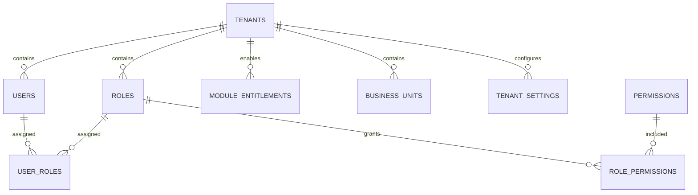
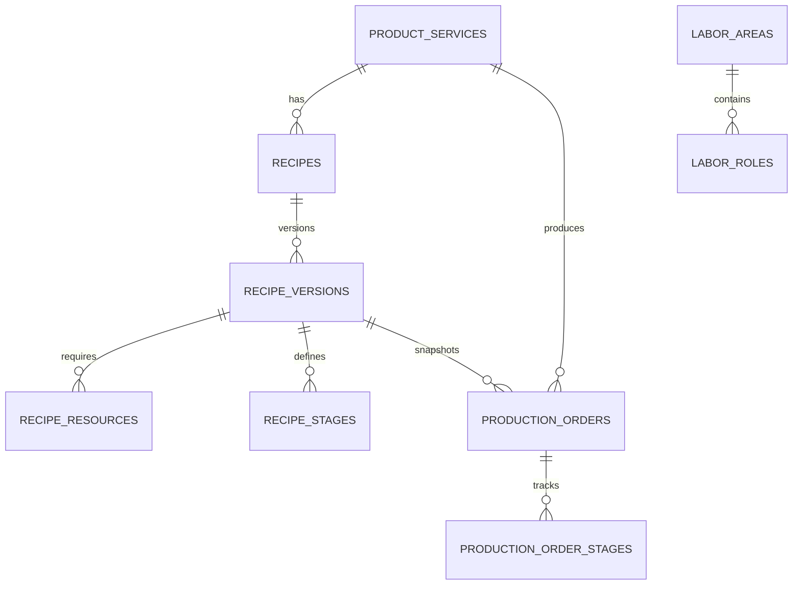
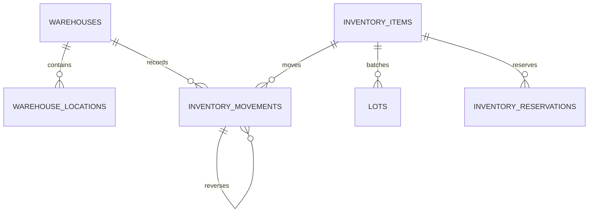
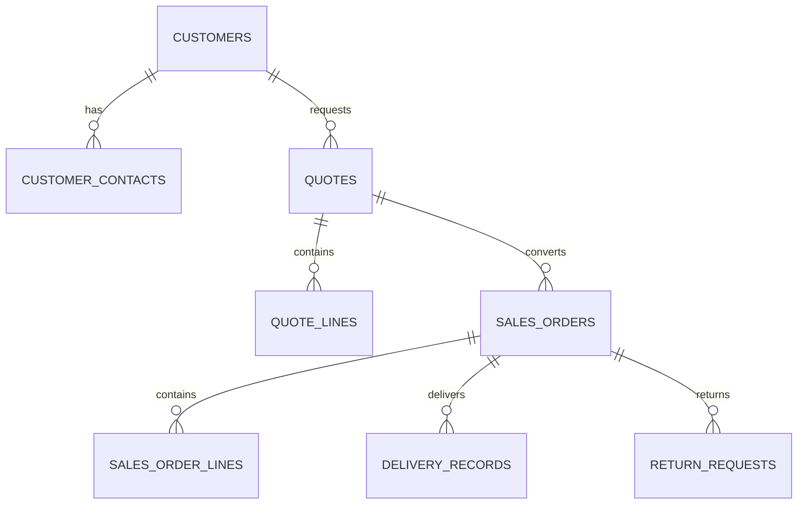

# ERClave - Modelo de datos MVP

## 1. Objetivo

Este documento convierte el ownership de datos del MVP en un modelo inicial para PostgreSQL.

Es un contrato tecnico vivo: las secciones iniciales conservan el modelo objetivo y las secciones de corte documentan las revisiones Alembic ya implementadas. Ante diferencias operativas, prevalecen la migracion vigente, el runtime, OpenAPI y `docs/contexto/ESTADO_ACTUAL.md`.

Este documento guia:

- migraciones iniciales;
- modelos SQLAlchemy/SQLModel;
- OpenAPI por servicio;
- validaciones backend;
- pruebas de aislamiento multi-tenant.

El modelo sigue estas reglas:

- cada servicio posee sus tablas;
- cada dato operativo de cliente incluye `tenant_id`;
- no existen llaves foraneas entre servicios;
- las referencias cruzadas usan IDs estables;
- cada operacion critica deja auditoria;
- las vistas calculadas no se editan directamente.

---

## 2. Estrategia inicial de base de datos

Para el MVP controlado se recomienda:

```text
1 instancia Cloud SQL PostgreSQL por ambiente
1 base de datos por ambiente
schemas separados por servicio
tenant_id en cada tabla operativa
```

Ejemplo:

```text
erclave_qa
  admin.*
  production.*
  inventory.*
  sales.*
  billing.*
  provisioning.*
  integrations.*
  audit.*

erclave_prod
  admin.*
  production.*
  inventory.*
  sales.*
  billing.*
  provisioning.*
  integrations.*
  audit.*
```

Esta estrategia evita el costo y complejidad de una base por tenant desde el inicio, pero mantiene aislamiento logico obligatorio.

### Evolucion futura

| Escala | Estrategia posible |
|---|---|
| MVP / 20 tenants | Una base compartida con `tenant_id` e indices compuestos. |
| 100+ tenants | Mantener compartida y mejorar particiones, indices y observabilidad. |
| Tenants enterprise | Schema dedicado, base dedicada o proyecto dedicado segun contrato. |

---

## 3. Convenciones de nombres

### 3.1 Identificadores

Se recomienda usar IDs estables tipo string con prefijo por entidad:

| Entidad | Ejemplo |
|---|---|
| Tenant | `ten_01J...` |
| Usuario | `usr_01J...` |
| Producto/servicio | `ps_01J...` |
| Receta | `rec_01J...` |
| Orden de produccion | `po_01J...` |
| Almacen | `wh_01J...` |
| Movimiento | `mov_01J...` |
| Cliente | `cus_01J...` |
| Cotizacion | `quo_01J...` |
| Pedido | `so_01J...` |

Opciones validas:

- UUID v7;
- ULID;
- CUID2.

El criterio importante es que sean unicos, estables, no secuenciales simples y seguros para exponer en APIs.

### 3.2 Columnas comunes

Tablas operativas por tenant:

```text
id
tenant_id
created_at
created_by
updated_at
updated_by
deleted_at
deleted_by
status
version
metadata
```

Tablas globales:

```text
id
created_at
created_by
updated_at
updated_by
status
version
metadata
```

Notas:

- `deleted_at` se usa para baja logica cuando aplique.
- `version` permite control optimista de concurrencia.
- `metadata` debe ser `jsonb` y no debe guardar reglas criticas sin estructura.
- `created_by` y `updated_by` guardan IDs de usuario o proceso.

### 3.3 Auditoria

Toda accion sensible debe registrar:

- `tenant_id`;
- actor;
- servicio origen;
- recurso;
- accion;
- estado anterior si aplica;
- estado nuevo si aplica;
- `correlation_id`;
- `idempotency_key` si aplica.

---

## 4. Tipos comunes sugeridos

| Campo | Tipo PostgreSQL sugerido |
|---|---|
| `id` | `varchar(40)` |
| `tenant_id` | `varchar(40)` |
| `code` | `varchar(80)` |
| `name` | `varchar(200)` |
| `description` | `text` |
| `status` | `varchar(40)` |
| `quantity` | `numeric(18,6)` |
| `money` | `numeric(18,6)` |
| `percentage` | `numeric(9,6)` |
| `timestamp` | `timestamptz` |
| `date` | `date` |
| `metadata` | `jsonb` |
| `snapshot` | `jsonb` |

Para el MVP se recomienda usar `varchar` para estatus y catalogos controlados desde backend. Cuando haya mayor estabilidad, se puede evaluar `enum` o tablas de catalogo por tenant.

---

## 5. Schema `admin`

Implementacion fisica inicial: ver `docs/arquitectura/admin_service_modelo_fisico.md`.

Nota de evolucion: el modelo fisico inicial de `admin-service` usa `admin.users` como identidad global y `admin.memberships` como relacion usuario-tenant. Esto mejora el soporte SaaS multi-tenant cuando una misma persona participa en mas de un tenant. Las tablas documentadas abajo quedan como modelo conceptual y se iran alineando con la implementacion fisica conforme avance el backend.

### 5.1 `admin.tenants`

Cliente/empresa que usa ERClave.

| Columna | Tipo | Reglas |
|---|---|---|
| `id` | `varchar(40)` | PK. |
| `slug` | `varchar(120)` | Unico global. Usado en URLs. |
| `legal_name` | `varchar(240)` | Nombre legal si existe. |
| `commercial_name` | `varchar(240)` | Nombre visible. |
| `status` | `varchar(40)` | `active`, `suspended`, `cancelled`, `provisioning`. |
| `plan_id` | `varchar(40)` | Referencia externa a `billing.plans`. Sin FK cruzada. |
| `timezone` | `varchar(80)` | Default `America/Mexico_City`. |
| `locale` | `varchar(20)` | Ejemplo `es-MX`. |
| `created_at` | `timestamptz` | Obligatorio. |
| `updated_at` | `timestamptz` | Obligatorio. |
| `metadata` | `jsonb` | Datos no criticos. |

Indices:

- `unique(slug)`;
- `index(status)`.

### 5.2 `admin.users`

Usuarios del cliente.

| Columna | Tipo | Reglas |
|---|---|---|
| `id` | `varchar(40)` | PK. |
| `tenant_id` | `varchar(40)` | FK interna a `admin.tenants.id`. |
| `identity_provider_id` | `varchar(160)` | ID de Identity Platform/OIDC. |
| `email` | `varchar(240)` | Unico por tenant. |
| `display_name` | `varchar(200)` | Visible en UI. |
| `status` | `varchar(40)` | `invited`, `active`, `disabled`. |
| `last_login_at` | `timestamptz` | Nullable. |
| `created_at` | `timestamptz` | Obligatorio. |
| `updated_at` | `timestamptz` | Obligatorio. |
| `metadata` | `jsonb` | Datos no criticos. |

Indices:

- `unique(tenant_id, email)`;
- `unique(identity_provider_id)`;
- `index(tenant_id, status)`.

### 5.3 `admin.roles`

Roles por tenant.

| Columna | Tipo | Reglas |
|---|---|---|
| `id` | `varchar(40)` | PK. |
| `tenant_id` | `varchar(40)` | FK interna. |
| `code` | `varchar(80)` | Unico por tenant. |
| `name` | `varchar(160)` | Nombre visible. |
| `description` | `text` | Nullable. |
| `status` | `varchar(40)` | `active`, `inactive`. |
| `permission_revision` | `integer` | Revision monotona del conjunto de permisos; inicia en 1. |
| `created_at` | `timestamptz` | Obligatorio. |
| `updated_at` | `timestamptz` | Obligatorio. |

Indices:

- `unique(tenant_id, code)`;
- `index(tenant_id, status)`.

### 5.4 `admin.permissions`

Catalogo global de permisos.

| Columna | Tipo | Reglas |
|---|---|---|
| `id` | `varchar(40)` | PK. |
| `code` | `varchar(160)` | Unico global. Ejemplo `production.recipe.approve`. |
| `module` | `varchar(80)` | Modulo. |
| `resource` | `varchar(80)` | Recurso. |
| `action` | `varchar(80)` | Accion. |
| `description` | `text` | Nullable. |
| `status` | `varchar(40)` | `active`, `inactive`. |
| `classification` | `varchar(20)` | `tenant`, `internal`, `public` o `integration`. |
| `assignable_to_tenant_role` | `boolean` | Solo `true` para capacidades humanas delegables. |
| `risk_level` | `varchar(20)` | `low`, `standard`, `high` o `critical`. |
| `display_name_es` | `varchar(200)` | Nombre humano en Espanol. |
| `display_name_en` | `varchar(200)` | Nombre humano en Ingles. |
| `description_es` | `text` | Explicacion operativa en Espanol. |
| `description_en` | `text` | Explicacion operativa en Ingles. |
| `sort_order` | `integer` | Orden estable de presentacion. |

Indices:

- `unique(code)`;
- `index(module, resource, action)`.

### 5.5 `admin.role_permissions`

Relacion rol-permiso.

| Columna | Tipo | Reglas |
|---|---|---|
| `id` | `varchar(40)` | PK. |
| `tenant_id` | `varchar(40)` | FK interna. |
| `role_id` | `varchar(40)` | FK a `admin.roles`. |
| `permission_id` | `varchar(40)` | FK a `admin.permissions`. |
| `scope` | `jsonb` | Alcance: centro, area, modulo, etc. |
| `created_at` | `timestamptz` | Obligatorio. |

Indices:

- `unique(tenant_id, role_id, permission_id)`.

Las asignaciones se modifican por diferencia; no se eliminan y recrean las filas que no cambiaron. Esto conserva fecha y `scope` por permiso.

### 5.6 `admin.user_roles`

Relacion usuario-rol.

| Columna | Tipo | Reglas |
|---|---|---|
| `id` | `varchar(40)` | PK. |
| `tenant_id` | `varchar(40)` | FK interna. |
| `user_id` | `varchar(40)` | FK a `admin.users`. |
| `role_id` | `varchar(40)` | FK a `admin.roles`. |
| `business_unit_id` | `varchar(40)` | Nullable. FK interna a `admin.business_units`. |
| `created_at` | `timestamptz` | Obligatorio. |

Indices:

- `unique(tenant_id, user_id, role_id, business_unit_id)`.

### 5.7 `admin.modules`

Catalogo global de modulos.

| Columna | Tipo | Reglas |
|---|---|---|
| `id` | `varchar(40)` | PK. |
| `code` | `varchar(80)` | Unico. Ejemplo `production`. |
| `name` | `varchar(160)` | Nombre visible. |
| `status` | `varchar(40)` | `active`, `inactive`, `planned`. |
| `metadata` | `jsonb` | Configuracion no critica. |

Indices:

- `unique(code)`.

### 5.8 `admin.module_entitlements`

Modulos contratados por tenant.

| Columna | Tipo | Reglas |
|---|---|---|
| `id` | `varchar(40)` | PK. |
| `tenant_id` | `varchar(40)` | FK interna. |
| `module_code` | `varchar(80)` | Referencia a modulo global por codigo. |
| `status` | `varchar(40)` | `active`, `inactive`, `suspended`. |
| `tenant_enabled` | `boolean` | Preferencia operativa del tenant; default `true`. No concede el modulo. |
| `limits` | `jsonb` | Limites por plan. |
| `source` | `varchar(40)` | `subscription`, `manual`, `trial`. |
| `starts_at` | `timestamptz` | Nullable. |

Regla calculada: el modulo esta disponible solo cuando `status = 'active' AND tenant_enabled = true`. `status` pertenece a Backoffice/Billing/Provisioning; `tenant_enabled` solo puede cambiarlo un administrador autorizado del mismo tenant. La implementacion fisica usa `admin.tenant_modules` e indice `(tenant_id, status, tenant_enabled)`.
| `ends_at` | `timestamptz` | Nullable. |

Indices:

- `unique(tenant_id, module_code)`;
- `index(tenant_id, status)`.

### 5.9 `admin.business_units`

Centros/unidades operativas dentro del tenant.

| Columna | Tipo | Reglas |
|---|---|---|
| `id` | `varchar(40)` | PK. |
| `tenant_id` | `varchar(40)` | FK interna. |
| `code` | `varchar(80)` | Unico por tenant. |
| `name` | `varchar(200)` | Obligatorio. |
| `status` | `varchar(40)` | `active`, `inactive`. |
| `metadata` | `jsonb` | Nullable. |

Indices:

- `unique(tenant_id, code)`.

### 5.10 `admin.tenant_settings`

Parametros por tenant.

| Columna | Tipo | Reglas |
|---|---|---|
| `id` | `varchar(40)` | PK. |
| `tenant_id` | `varchar(40)` | FK interna. |
| `module_code` | `varchar(80)` | Nullable para parametros globales. |
| `key` | `varchar(160)` | Clave. |
| `value` | `jsonb` | Valor estructurado. |
| `created_at` | `timestamptz` | Obligatorio. |
| `updated_at` | `timestamptz` | Obligatorio. |

Indices:

- `unique(tenant_id, key)`;
- `index(tenant_id, module_code)`.

#### `organization.profile`

Todo tenant creado por seed, provisioning o API interna debe tener un registro:

| Campo | Valor |
|---|---|
| `module_code` | `admin` |
| `key` | `organization.profile` |
| `value.corporate` | Perfil corporativo del tenant. |
| `value.legal_entities` | Lista inicial de razones sociales/fiscales. |
| `value.branches` | Lista inicial de sucursales. |

Estructura minima:

```json
{
  "corporate": {
    "commercial_name": "Cliente",
    "legal_name": "Cliente S.A. de C.V.",
    "tax_id": "",
    "phone": "",
    "contact_name": "",
    "contact_email": "",
    "contact_phone": "",
    "contact_position": ""
  },
  "legal_entities": [],
  "branches": []
}
```

Regla de evolucion: mientras Administracion use `tenant_settings`, este JSONB es la fuente de verdad administrativa. Cuando facturacion/contabilidad requieran constraints fiscales, folios, certificados o integracion SAT, las razones sociales y sucursales podran promoverse a tablas dedicadas con migracion/backfill documentado.

### 5.11 `admin.code_sequences`

Autoridad tenant-safe para codigos visibles de documentos y catalogos.

| Columna | Tipo | Reglas |
|---|---|---|
| `id` | `varchar(40)` | PK. |
| `tenant_id` | `varchar(40)` | FK interna a tenant. |
| `document_type` | `varchar(80)` | Tipo estable, unico por tenant. |
| `module_code` | `varchar(40)` | Modulo consumidor. |
| `prefix` | `varchar(24)` | Prefijo configurable. |
| `separator` | `varchar(3)` | Separador configurable. |
| `next_number` | `integer` | Mayor o igual que 1; se incrementa con bloqueo de fila. |
| `padding` | `integer` | Entre 1 y 12. |
| `mode` | `varchar(20)` | `managed` o `manual`. |
| `status` | `varchar(20)` | `active` o `inactive`. |

Indice unico: `unique(tenant_id, document_type)`. La asignacion se registra en idempotencia y auditoria del schema Admin.

---

## 6. Schema `production`

### 6.1 `production.product_services`

Catalogo maestro de productos y servicios.

| Columna | Tipo | Reglas |
|---|---|---|
| `id` | `varchar(40)` | PK. |
| `tenant_id` | `varchar(40)` | Obligatorio. |
| `code` | `varchar(80)` | SKU/codigo interno unico por tenant. |
| `name` | `varchar(240)` | Obligatorio. |
| `type` | `varchar(40)` | `product`, `service`. |
| `category` | `varchar(120)` | Nullable. |
| `base_unit` | `varchar(40)` | Unidad base. |
| `status` | `varchar(40)` | `active`, `inactive`, `pending_approval`. |
| `target_price` | `numeric(18,6)` | Nullable. |
| `standard_cost` | `numeric(18,6)` | Calculado desde receta aprobada; nullable. |
| `current_recipe_version_id` | `varchar(40)` | FK interna nullable a version aprobada. |
| `responsible_area` | `varchar(120)` | Nullable. |
| `metadata` | `jsonb` | Datos no criticos. |
| `created_at` | `timestamptz` | Obligatorio. |
| `updated_at` | `timestamptz` | Obligatorio. |

Indices:

- `unique(tenant_id, code)`;
- `index(tenant_id, type, status)`;
- `index(tenant_id, name)`.

### 6.2 `production.recipes`

Cabecera logica de receta por producto/servicio.

| Columna | Tipo | Reglas |
|---|---|---|
| `id` | `varchar(40)` | PK. |
| `tenant_id` | `varchar(40)` | Obligatorio. |
| `product_service_id` | `varchar(40)` | FK interna. |
| `code` | `varchar(80)` | Unico por tenant. |
| `name` | `varchar(240)` | Nombre visible. |
| `status` | `varchar(40)` | `draft`, `active`, `inactive`. |
| `current_version_id` | `varchar(40)` | FK interna nullable. |
| `metadata` | `jsonb` | Nullable. |
| `created_at` | `timestamptz` | Obligatorio. |
| `updated_at` | `timestamptz` | Obligatorio. |

Indices:

- `unique(tenant_id, code)`;
- `index(tenant_id, product_service_id)`.

### 6.3 `production.recipe_versions`

Versiones de receta. Las ordenes deben tomar snapshot de esta version.

| Columna | Tipo | Reglas |
|---|---|---|
| `id` | `varchar(40)` | PK. |
| `tenant_id` | `varchar(40)` | Obligatorio. |
| `recipe_id` | `varchar(40)` | FK interna. |
| `version_number` | `integer` | Secuencial por receta. |
| `status` | `varchar(40)` | `draft`, `pending_approval`, `approved`, `obsolete`. |
| `base_quantity` | `numeric(18,6)` | Cantidad base. |
| `base_unit` | `varchar(40)` | Unidad. |
| `standard_cost` | `numeric(18,6)` | Costo calculado de version. |
| `change_reason` | `text` | Obligatorio al cambiar version vigente. |
| `approved_at` | `timestamptz` | Nullable. |
| `approved_by` | `varchar(40)` | Nullable. |
| `obsolete_at` | `timestamptz` | Nullable. |
| `snapshot` | `jsonb` | Copia estructurada para auditoria. |
| `created_at` | `timestamptz` | Obligatorio. |
| `updated_at` | `timestamptz` | Obligatorio. |

Indices:

- `unique(tenant_id, recipe_id, version_number)`;
- `index(tenant_id, recipe_id, status)`.

### 6.4 `production.recipe_resources`

Recursos requeridos por version de receta.

| Columna | Tipo | Reglas |
|---|---|---|
| `id` | `varchar(40)` | PK. |
| `tenant_id` | `varchar(40)` | Obligatorio. |
| `recipe_version_id` | `varchar(40)` | FK interna. |
| `resource_type` | `varchar(40)` | `material`, `labor`, `machine`, `other`. |
| `resource_ref_id` | `varchar(40)` | ID interno o externo segun tipo. |
| `resource_code` | `varchar(80)` | Codigo visible al momento de capturar. |
| `resource_name` | `varchar(240)` | Nombre visible. |
| `quantity` | `numeric(18,6)` | Cantidad requerida. |
| `unit` | `varchar(40)` | Unidad. |
| `unit_cost` | `numeric(18,6)` | Costo unitario estimado. |
| `total_cost` | `numeric(18,6)` | Cantidad * costo. |
| `sort_order` | `integer` | Orden visual. |
| `metadata` | `jsonb` | Nullable. |

Reglas:

- Si `resource_type = material`, `resource_ref_id` apunta a `inventory.inventory_items.id` sin FK cruzada.
- Si `resource_type = labor`, `resource_ref` conserva el ID externo de `hr.labor_roles`; no existe FK fisica entre servicios y la version guarda el snapshot necesario.
- Si `resource_type = machine`, apunta a `production.machines.id`.

Indices:

- `index(tenant_id, recipe_version_id)`;
- `index(tenant_id, resource_type, resource_ref_id)`.

### 6.5 `production.recipe_stages`

Etapas operativas vinculadas a areas activas de Recursos Humanos al crear la version. Produccion conserva referencia externa y snapshot; no escribe el schema `hr`.

| Columna | Tipo | Reglas |
|---|---|---|
| `id` | `varchar(40)` | PK. |
| `tenant_id` | `varchar(40)` | Obligatorio. |
| `recipe_version_id` | `varchar(40)` | FK interna. |
| `labor_area_ref_id` | `varchar(40)` | ID externo de `hr.labor_areas`, sin FK cruzada; nullable solo para historia anterior. |
| `labor_area_name` | `varchar(200)` | Snapshot del nombre del area. |
| `name` | `varchar(200)` | Obligatorio. |
| `description` | `text` | Nullable. |
| `expected_minutes` | `numeric(18,6)` | Nullable. |
| `sort_order` | `integer` | Obligatorio. |
| `weight_percent` | `numeric(5,2)` | Mayor que 0 y menor o igual que 100. Las etapas activas suman 100. |
| `status` | `varchar(40)` | `active`, `inactive`. |

Indices:

- `index(tenant_id, recipe_version_id, sort_order)`.
- `index(tenant_id, labor_area_ref_id)`.

### 6.6 `production.production_orders`

Orden operativa generada desde receta aprobada o solicitud externa.

| Columna | Tipo | Reglas |
|---|---|---|
| `id` | `varchar(40)` | PK. |
| `tenant_id` | `varchar(40)` | Obligatorio. |
| `code` | `varchar(80)` | Unico por tenant. |
| `product_service_id` | `varchar(40)` | FK interna. |
| `recipe_id` | `varchar(40)` | FK interna. |
| `recipe_version_id` | `varchar(40)` | FK interna. |
| `quantity` | `numeric(18,6)` | Cantidad a producir/ejecutar. |
| `unit` | `varchar(40)` | Unidad. |
| `status` | `varchar(40)` | `released`, `waiting_resources`, `in_progress`, `paused`, `in_validation`, `completed`, `cancelled`. |
| `priority` | `varchar(40)` | `low`, `normal`, `high`, `urgent`. |
| `required_at` | `timestamptz` | Fecha requerida, nullable. |
| `responsible_name` | `varchar(200)` | Snapshot del responsable, nullable. |
| `planned_start_at` | `timestamptz` | Nullable. |
| `planned_end_at` | `timestamptz` | Nullable. |
| `actual_start_at` | `timestamptz` | Nullable. |
| `actual_end_at` | `timestamptz` | Nullable. |
| `source_type` | `varchar(40)` | `manual`, `sales_order`, `integration`. |
| `source_id` | `varchar(40)` | ID externo sin FK cruzada. |
| `source_line_id` | `varchar(40)` | Nullable. |
| `planned_cost` | `numeric(18,6)` | Estimado. |
| `actual_cost` | `numeric(18,6)` | Nullable. |
| `recipe_snapshot` | `jsonb` | Obligatorio al liberar. |
| `resource_validation_snapshot` | `jsonb` | Disponibilidad y costos observados al liberar. |
| `validated_at` | `timestamptz` | Momento de la validacion backend. |
| `created_by` | `varchar(160)` | Actor autenticado que libero la orden. |
| `metadata` | `jsonb` | Contexto extensible, nullable. |
| `created_at` | `timestamptz` | Obligatorio. |
| `updated_at` | `timestamptz` | Obligatorio. |

Indices:

- `unique(tenant_id, code)`;
- `index(tenant_id, status)`;
- `index(tenant_id, product_service_id)`;
- `index(tenant_id, source_type, source_id)`.

### 6.7 `production.production_order_stages`

Etapas reales copiadas desde la receta al generar orden.

| Columna | Tipo | Reglas |
|---|---|---|
| `id` | `varchar(40)` | PK. |
| `tenant_id` | `varchar(40)` | Obligatorio. |
| `production_order_id` | `varchar(40)` | FK interna. |
| `recipe_stage_id` | `varchar(40)` | Referencia interna original. |
| `name` | `varchar(200)` | Snapshot de nombre. |
| `description` | `text` | Snapshot de descripcion, nullable. |
| `sort_order` | `integer` | Obligatorio. |
| `weight_percent` | `numeric(5,2)` | Snapshot del peso de la fase. |
| `labor_area_ref_id` | `varchar(40)` | Referencia externa RH, sin FK cruzada. |
| `labor_area_name` | `varchar(200)` | Snapshot del area. |
| `status` | `varchar(40)` | `pending`, `in_progress`, `completed`, `skipped`, `blocked`. |
| `planned_minutes` | `numeric(18,6)` | Nullable. |
| `actual_minutes` | `numeric(18,6)` | Nullable. |
| `responsible_name` | `varchar(200)` | Responsable asignado, nullable. |
| `progress_percentage` | `numeric(5,2)` | Avance entre 0 y 100. |
| `started_at` | `timestamptz` | Nullable. |
| `completed_at` | `timestamptz` | Nullable. |
| `notes` | `text` | Nullable. |
| `metadata` | `jsonb` | Contexto extensible, nullable. |
| `created_at` | `timestamptz` | Obligatorio. |
| `updated_at` | `timestamptz` | Obligatorio. |

Indices:

- `index(tenant_id, production_order_id, sort_order)`;
- `index(tenant_id, status)`.

### 6.8 `hr.labor_areas`

Areas operativas para mano de obra.

| Columna | Tipo | Reglas |
|---|---|---|
| `id` | `varchar(40)` | PK. |
| `tenant_id` | `varchar(40)` | Obligatorio. |
| `code` | `varchar(80)` | Unico por tenant. |
| `name` | `varchar(200)` | Obligatorio. |
| `description` | `text` | Nullable. |
| `status` | `varchar(40)` | `active`, `inactive`. |

Indices:

- `unique(tenant_id, code)`;
- `index(tenant_id, name)`.

### 6.9 `hr.labor_roles`

Roles/puestos y cantidad de recursos disponibles.

| Columna | Tipo | Reglas |
|---|---|---|
| `id` | `varchar(40)` | PK. |
| `tenant_id` | `varchar(40)` | Obligatorio. |
| `labor_area_id` | `varchar(40)` | FK interna. |
| `position` | `varchar(160)` | Nombre del puesto, unico dentro del area y tenant. |
| `recipe_name` | `varchar(160)` | Nombre visible en recetas. |
| `resource_quantity` | `integer` | Cantidad nominal de recursos; mayor a cero. |
| `minutes_per_resource` | `integer` | Minutos disponibles por recurso; mayor a cero. |
| `hourly_cost` | `numeric(18,6)` | Costo por hora no negativo. |
| `intervenes_in_production` | `boolean` | Habilita la seleccion en nuevas recetas. |
| `status` | `varchar(40)` | `active`, `inactive`. |

Indices:

- `unique(tenant_id, labor_area_id, position)`;
- FK compuesto `(tenant_id, labor_area_id)` hacia `hr.labor_areas`;
- `index(tenant_id, labor_area_id, status)`;
- `index(tenant_id, intervenes_in_production, status)`.

### 6.9.1 `hr.workers`

Expediente minimo del trabajador. Cada registro mantiene un unico puesto vigente; varios trabajadores pueden referenciar el mismo puesto.

| Columna | Tipo | Reglas |
|---|---|---|
| `id` | `varchar(40)` | PK. |
| `tenant_id` | `varchar(40)` | Obligatorio. |
| `employee_number` | `varchar(40)` | Unico por tenant. |
| `first_names`, `first_last_name` | `varchar` | Obligatorios. |
| `second_last_name` | `varchar(100)` | Opcional. |
| `curp` | `varchar(18)` | Unico por tenant; formato validado. |
| `rfc` | `varchar(13)` | Unico por tenant; persona fisica. |
| `nss` | `varchar(11)` | Unico por tenant; digitos y verificador validos. |
| `hire_date` | `date` | Obligatoria; no futura. |
| `labor_position_id` | `varchar(40)` | FK interna compuesta con tenant hacia `hr.labor_roles`. |
| `status` | `varchar(20)` | `active`, `inactive`, `terminated`; no se elimina historia. |
| contacto, nacimiento, nacionalidad, estado civil, domicilio, emergencia, notas | varios | Opcionales y minimizados. |

Indices: `unique(tenant_id, employee_number/curp/rfc/nss)` e `index(tenant_id, labor_position_id, status)`.

### 6.10 `production.machines`

Maquinaria o recursos tecnicos.

| Columna | Tipo | Reglas |
|---|---|---|
| `id` | `varchar(40)` | PK. |
| `tenant_id` | `varchar(40)` | Obligatorio. |
| `code` | `varchar(80)` | Unico por tenant. |
| `name` | `varchar(200)` | Obligatorio. |
| `machine_type` | `varchar(120)` | Tipo de maquinaria, nullable. |
| `area_name` | `varchar(200)` | Area donde opera. |
| `available_minutes_per_day` | `numeric(18,6)` | Capacidad diaria disponible. |
| `cost_per_minute` | `numeric(18,6)` | Costo no negativo por minuto. |
| `status` | `varchar(40)` | `active`, `inactive`, `maintenance`. |
| `metadata` | `jsonb` | Nullable. |
| `created_at` | `timestamptz` | Obligatorio. |
| `updated_at` | `timestamptz` | Obligatorio. |

Indices:

- `unique(tenant_id, code)`;
- `index(tenant_id, status)`.

---

## 7. Schema `inventory`

### 7.1 `inventory.warehouses`

Almacenes configurables.

| Columna | Tipo | Reglas |
|---|---|---|
| `id` | `varchar(40)` | PK. |
| `tenant_id` | `varchar(40)` | Obligatorio. |
| `code` | `varchar(80)` | Unico por tenant. |
| `name` | `varchar(200)` | Obligatorio. |
| `type` | `varchar(60)` | `raw_material`, `consumable`, `wip`, `finished_goods`, `returns`, `scrap`, `general`. |
| `status` | `varchar(40)` | `active`, `inactive`. |
| `metadata` | `jsonb` | Nullable. |

Indices:

- `unique(tenant_id, code)`;
- `index(tenant_id, type, status)`.

### 7.2 `inventory.warehouse_locations`

Ubicaciones internas opcionales.

| Columna | Tipo | Reglas |
|---|---|---|
| `id` | `varchar(40)` | PK. |
| `tenant_id` | `varchar(40)` | Obligatorio. |
| `warehouse_id` | `varchar(40)` | FK interna. |
| `code` | `varchar(80)` | Unico por almacen. |
| `name` | `varchar(160)` | Obligatorio. |
| `status` | `varchar(40)` | `active`, `inactive`. |

Indices:

- `unique(tenant_id, warehouse_id, code)`.

### 7.3 `inventory.inventory_items`

Articulos inventariables.

| Columna | Tipo | Reglas |
|---|---|---|
| `id` | `varchar(40)` | PK. |
| `tenant_id` | `varchar(40)` | Obligatorio. |
| `code` | `varchar(80)` | Unico por tenant. |
| `name` | `varchar(240)` | Obligatorio. |
| `type` | `varchar(60)` | `raw_material`, `consumable`, `tool`, `finished_goods`, `spare_part`, `supply`. |
| `category` | `varchar(120)` | Nullable. |
| `base_unit` | `varchar(40)` | Obligatorio. |
| `default_unit_cost` | `numeric(18,6)` | Costo manual por una unidad base; fallback cuando no existe saldo valuado. |
| `inventory_policy` | `varchar(60)` | `standard`, `lot`, `serial`, `restricted`. |
| `suggested_warehouse_id` | `varchar(40)` | FK interna nullable. |
| `status` | `varchar(40)` | `active`, `inactive`, `blocked`. |
| `metadata` | `jsonb` | Nullable. |

Indices:

- `unique(tenant_id, code)`;
- `index(tenant_id, type, status)`;
- `index(tenant_id, name)`.

### 7.4 `inventory.lots`

Lotes. Puede quedar inactivo en MVP si se pospone trazabilidad por lote.

| Columna | Tipo | Reglas |
|---|---|---|
| `id` | `varchar(40)` | PK. |
| `tenant_id` | `varchar(40)` | Obligatorio. |
| `inventory_item_id` | `varchar(40)` | FK interna. |
| `lot_code` | `varchar(120)` | Unico por articulo. |
| `expiration_date` | `date` | Nullable. |
| `status` | `varchar(40)` | `active`, `blocked`, `expired`, `consumed`. |
| `metadata` | `jsonb` | Nullable. |

Indices:

- `unique(tenant_id, inventory_item_id, lot_code)`;
- `index(tenant_id, status)`.

### 7.5 `inventory.inventory_movements`

Fuente de verdad para kardex y existencias.

| Columna | Tipo | Reglas |
|---|---|---|
| `id` | `varchar(40)` | PK. |
| `tenant_id` | `varchar(40)` | Obligatorio. |
| `movement_code` | `varchar(80)` | Unico por tenant. |
| `movement_type` | `varchar(60)` | `purchase_receipt`, `production_receipt`, `transfer`, `positive_adjustment`, `negative_adjustment`, `production_consumption`, `customer_return`, `supplier_return`, `sale_shipment`. |
| `inventory_item_id` | `varchar(40)` | FK interna. |
| `warehouse_id` | `varchar(40)` | FK interna. |
| `warehouse_location_id` | `varchar(40)` | FK interna nullable. |
| `lot_id` | `varchar(40)` | FK interna nullable. |
| `direction` | `varchar(20)` | `in`, `out`, `neutral`. |
| `quantity` | `numeric(18,6)` | Mayor que cero. |
| `unit` | `varchar(40)` | Unidad del movimiento. |
| `unit_cost` | `numeric(18,6)` | Nullable. |
| `total_cost` | `numeric(18,6)` | Nullable. |
| `source_type` | `varchar(60)` | `manual`, `production_order`, `sales_order`, `purchase_order`, `adjustment`. |
| `source_id` | `varchar(40)` | ID externo sin FK cruzada. |
| `source_line_id` | `varchar(40)` | Nullable. |
| `reason` | `text` | Obligatorio en ajustes/manuales. |
| `idempotency_key` | `varchar(200)` | Obligatorio para solicitudes externas. |
| `status` | `varchar(40)` | `recorded`, `reversed`, `cancelled`. |
| `recorded_at` | `timestamptz` | Obligatorio. |
| `recorded_by` | `varchar(40)` | Obligatorio. |
| `reversal_of_movement_id` | `varchar(40)` | FK interna nullable. |
| `metadata` | `jsonb` | Nullable. |

Indices:

- `unique(tenant_id, movement_code)`;
- `unique(tenant_id, idempotency_key) where idempotency_key is not null`;
- `index(tenant_id, inventory_item_id, warehouse_id)`;
- `index(tenant_id, source_type, source_id)`;
- `index(tenant_id, recorded_at)`.

Reglas:

- No se borra un movimiento registrado; se reversa.
- Existencias se calculan desde movimientos `recorded` no reversados.

### 7.6 `inventory.inventory_reservations`

Reserva de inventario. El modelo conceptual se materializo para ordenes de Produccion en la revision Local `20260818_0017`; consultar la seccion 20 para constraints, valuacion, concurrencia y relaciones definitivas del corte. Reservas para Ventas y otros origenes permanecen futuras.

| Columna | Tipo | Reglas |
|---|---|---|
| `id` | `varchar(40)` | PK. |
| `tenant_id` | `varchar(40)` | Obligatorio. |
| `inventory_item_id` | `varchar(40)` | FK interna. |
| `warehouse_id` | `varchar(40)` | FK interna nullable. |
| `quantity` | `numeric(18,6)` | Mayor que cero. |
| `unit` | `varchar(40)` | Obligatorio. |
| `source_type` | `varchar(60)` | `sales_order`, `production_order`, `manual`. |
| `source_id` | `varchar(40)` | ID externo. |
| `source_line_id` | `varchar(40)` | Nullable. |
| `status` | `varchar(40)` | `active`, `released`, `consumed`, `expired`, `cancelled`. |
| `expires_at` | `timestamptz` | Nullable. |
| `idempotency_key` | `varchar(200)` | Obligatorio para solicitudes externas. |

Indices:

- `unique(tenant_id, idempotency_key) where idempotency_key is not null`;
- `index(tenant_id, inventory_item_id, status)`;
- `index(tenant_id, source_type, source_id)`.

### 7.7 `inventory.inventory_balances`

Vista materializada o tabla recalculada desde movimientos y reservas.

| Columna | Tipo | Reglas |
|---|---|---|
| `tenant_id` | `varchar(40)` | Obligatorio. |
| `inventory_item_id` | `varchar(40)` | Obligatorio. |
| `warehouse_id` | `varchar(40)` | Obligatorio. |
| `warehouse_location_id` | `varchar(40)` | Nullable. |
| `lot_id` | `varchar(40)` | Nullable. |
| `unit` | `varchar(40)` | Obligatorio. |
| `on_hand_quantity` | `numeric(18,6)` | Calculado. |
| `reserved_quantity` | `numeric(18,6)` | Calculado. |
| `available_quantity` | `numeric(18,6)` | `on_hand - reserved`. |
| `updated_at` | `timestamptz` | Obligatorio. |

Indices:

- `unique(tenant_id, inventory_item_id, warehouse_id, warehouse_location_id, lot_id, unit)`;
- `index(tenant_id, inventory_item_id)`.

Regla:

- No se edita por UI. Se recalcula desde movimientos/reservas.

---

## 8. Schema `sales`

### 8.1 `sales.customers`

Clientes comerciales.

| Columna | Tipo | Reglas |
|---|---|---|
| `id` | `varchar(40)` | PK. |
| `tenant_id` | `varchar(40)` | Obligatorio. |
| `code` | `varchar(80)` | Unico por tenant. |
| `commercial_name` | `varchar(240)` | Obligatorio. |
| `customer_type` | `varchar(60)` | `company`, `individual`, `government`, `internal`. |
| `status` | `varchar(40)` | `prospect`, `active`, `inactive`, `blocked`. |
| `payment_terms` | `varchar(120)` | Nullable. |
| `currency` | `varchar(10)` | Nullable. |
| `billing_profile` | `jsonb` | Datos fiscales/facturacion. |
| `commercial_profile` | `jsonb` | Datos comerciales. |
| `created_at` | `timestamptz` | Obligatorio. |
| `updated_at` | `timestamptz` | Obligatorio. |

Indices:

- `unique(tenant_id, code)`;
- `index(tenant_id, status)`;
- `index(tenant_id, commercial_name)`.

### 8.2 `sales.customer_contacts`

Contactos de cliente.

| Columna | Tipo | Reglas |
|---|---|---|
| `id` | `varchar(40)` | PK. |
| `tenant_id` | `varchar(40)` | Obligatorio. |
| `customer_id` | `varchar(40)` | FK interna. |
| `name` | `varchar(200)` | Obligatorio. |
| `email` | `varchar(240)` | Nullable. |
| `phone` | `varchar(80)` | Nullable. |
| `role` | `varchar(120)` | Nullable. |
| `is_primary` | `boolean` | Default false. |
| `status` | `varchar(40)` | `active`, `inactive`. |

Indices:

- `index(tenant_id, customer_id)`.

### 8.3 `sales.quotes`

Cotizaciones.

| Columna | Tipo | Reglas |
|---|---|---|
| `id` | `varchar(40)` | PK. |
| `tenant_id` | `varchar(40)` | Obligatorio. |
| `code` | `varchar(80)` | Unico por tenant. |
| `customer_id` | `varchar(40)` | FK interna. |
| `status` | `varchar(40)` | `draft`, `quoted`, `approved`, `expired`, `cancelled`. |
| `currency` | `varchar(10)` | Obligatorio. |
| `subtotal` | `numeric(18,6)` | Calculado. |
| `discount_total` | `numeric(18,6)` | Calculado. |
| `tax_total` | `numeric(18,6)` | Calculado. |
| `total` | `numeric(18,6)` | Calculado. |
| `valid_until` | `date` | Nullable. |
| `approved_at` | `timestamptz` | Nullable. |
| `approved_by` | `varchar(40)` | Nullable. |
| `created_at` | `timestamptz` | Obligatorio. |
| `updated_at` | `timestamptz` | Obligatorio. |

Indices:

- `unique(tenant_id, code)`;
- `index(tenant_id, customer_id)`;
- `index(tenant_id, status)`.

### 8.4 `sales.quote_lines`

Partidas de cotizacion.

| Columna | Tipo | Reglas |
|---|---|---|
| `id` | `varchar(40)` | PK. |
| `tenant_id` | `varchar(40)` | Obligatorio. |
| `quote_id` | `varchar(40)` | FK interna. |
| `line_number` | `integer` | Secuencial. |
| `product_service_id` | `varchar(40)` | Referencia externa a Produccion. |
| `product_service_code` | `varchar(80)` | Snapshot. |
| `product_service_name` | `varchar(240)` | Snapshot. |
| `quantity` | `numeric(18,6)` | Mayor que cero. |
| `unit` | `varchar(40)` | Obligatorio. |
| `unit_price` | `numeric(18,6)` | Obligatorio. |
| `standard_cost` | `numeric(18,6)` | Snapshot opcional desde Produccion. |
| `discount_amount` | `numeric(18,6)` | Default 0. |
| `tax_amount` | `numeric(18,6)` | Default 0. |
| `line_total` | `numeric(18,6)` | Calculado. |

Indices:

- `unique(tenant_id, quote_id, line_number)`;
- `index(tenant_id, product_service_id)`.

### 8.5 `sales.sales_orders`

Pedidos comerciales.

| Columna | Tipo | Reglas |
|---|---|---|
| `id` | `varchar(40)` | PK. |
| `tenant_id` | `varchar(40)` | Obligatorio. |
| `code` | `varchar(80)` | Unico por tenant. |
| `quote_id` | `varchar(40)` | FK interna nullable si se permite pedido directo futuro. |
| `customer_id` | `varchar(40)` | FK interna. |
| `status` | `varchar(40)` | `draft`, `confirmed`, `pending_inventory`, `pending_production`, `partially_fulfilled`, `fulfilled`, `cancelled`. |
| `fulfillment_mode` | `varchar(60)` | `inventory`, `production`, `mixed`, `service`, `pending`. |
| `currency` | `varchar(10)` | Obligatorio. |
| `subtotal` | `numeric(18,6)` | Calculado. |
| `tax_total` | `numeric(18,6)` | Calculado. |
| `total` | `numeric(18,6)` | Calculado. |
| `estimated_cost` | `numeric(18,6)` | Desde costos estandar. |
| `estimated_margin` | `numeric(18,6)` | Calculado. |
| `promised_delivery_date` | `date` | Nullable. |
| `created_at` | `timestamptz` | Obligatorio. |
| `updated_at` | `timestamptz` | Obligatorio. |

Indices:

- `unique(tenant_id, code)`;
- `index(tenant_id, customer_id)`;
- `index(tenant_id, status)`.

### 8.6 `sales.sales_order_lines`

Partidas de pedido.

| Columna | Tipo | Reglas |
|---|---|---|
| `id` | `varchar(40)` | PK. |
| `tenant_id` | `varchar(40)` | Obligatorio. |
| `sales_order_id` | `varchar(40)` | FK interna. |
| `quote_line_id` | `varchar(40)` | FK interna nullable. |
| `line_number` | `integer` | Secuencial. |
| `product_service_id` | `varchar(40)` | Referencia externa a Produccion. |
| `product_service_snapshot` | `jsonb` | Snapshot minimo para auditoria. |
| `quantity` | `numeric(18,6)` | Mayor que cero. |
| `unit` | `varchar(40)` | Obligatorio. |
| `unit_price` | `numeric(18,6)` | Obligatorio. |
| `standard_cost` | `numeric(18,6)` | Snapshot. |
| `line_total` | `numeric(18,6)` | Calculado. |
| `fulfillment_status` | `varchar(60)` | `pending`, `reserved`, `production_requested`, `ready`, `delivered`, `cancelled`. |
| `production_order_id` | `varchar(40)` | Referencia externa nullable. |
| `reservation_id` | `varchar(40)` | Referencia externa nullable. |

Indices:

- `unique(tenant_id, sales_order_id, line_number)`;
- `index(tenant_id, product_service_id)`;
- `index(tenant_id, production_order_id)`.

### 8.7 `sales.delivery_records`

Vista/registro operativo de entregas. En MVP puede iniciar como tabla de seguimiento sin impacto directo en inventario.

| Columna | Tipo | Reglas |
|---|---|---|
| `id` | `varchar(40)` | PK. |
| `tenant_id` | `varchar(40)` | Obligatorio. |
| `sales_order_id` | `varchar(40)` | FK interna. |
| `code` | `varchar(80)` | Unico por tenant. |
| `status` | `varchar(40)` | `pending`, `in_route`, `partial`, `delivered`, `failed`, `cancelled`. |
| `recipient_name` | `varchar(200)` | Nullable. |
| `delivered_at` | `timestamptz` | Nullable. |
| `notes` | `text` | Nullable. |
| `inventory_movement_id` | `varchar(40)` | Referencia externa futura. |

Indices:

- `unique(tenant_id, code)`;
- `index(tenant_id, sales_order_id)`;
- `index(tenant_id, status)`.

### 8.8 `sales.return_requests`

Devoluciones comerciales.

| Columna | Tipo | Reglas |
|---|---|---|
| `id` | `varchar(40)` | PK. |
| `tenant_id` | `varchar(40)` | Obligatorio. |
| `sales_order_id` | `varchar(40)` | FK interna. |
| `delivery_record_id` | `varchar(40)` | FK interna nullable. |
| `status` | `varchar(40)` | `requested`, `approved`, `rejected`, `received`, `closed`. |
| `reason` | `text` | Obligatorio. |
| `resolution` | `varchar(80)` | `restock`, `scrap`, `review`, `refund`, `replace`, nullable. |
| `created_at` | `timestamptz` | Obligatorio. |

Indices:

- `index(tenant_id, sales_order_id)`;
- `index(tenant_id, status)`.

---

## 9. Schema `billing`

### 9.1 `billing.plans`

Planes comerciales globales.

| Columna | Tipo | Reglas |
|---|---|---|
| `id` | `varchar(40)` | PK. |
| `code` | `varchar(80)` | Unico global. |
| `name` | `varchar(160)` | Obligatorio. |
| `status` | `varchar(40)` | `active`, `inactive`, `archived`. |
| `billing_period` | `varchar(40)` | `monthly`, `annual`, `manual`. |
| `price_amount` | `numeric(18,6)` | Nullable si precio comercial manual. |
| `currency` | `varchar(10)` | Nullable. |
| `included_modules` | `jsonb` | Modulos incluidos. |
| `limits` | `jsonb` | Limites del plan. |
| `metadata` | `jsonb` | Nullable. |

Indices:

- `unique(code)`;
- `index(status)`.

### 9.2 `billing.subscriptions`

Suscripciones por tenant.

| Columna | Tipo | Reglas |
|---|---|---|
| `id` | `varchar(40)` | PK. |
| `tenant_id` | `varchar(40)` | Referencia externa a Admin. Puede ser nullable antes de provisioning. |
| `plan_id` | `varchar(40)` | FK interna a `billing.plans`. |
| `status` | `varchar(40)` | `pending`, `active`, `past_due`, `cancelled`, `trialing`. |
| `source` | `varchar(40)` | `online_payment`, `manual`, `trial`. |
| `payment_provider` | `varchar(80)` | Ejemplo `stripe`. Nullable para manual. |
| `payment_provider_customer_id` | `varchar(160)` | Nullable. |
| `payment_provider_subscription_id` | `varchar(160)` | Nullable. |
| `current_period_start` | `timestamptz` | Nullable. |
| `current_period_end` | `timestamptz` | Nullable. |
| `created_at` | `timestamptz` | Obligatorio. |
| `updated_at` | `timestamptz` | Obligatorio. |

Indices:

- `index(tenant_id, status)`;
- `unique(payment_provider, payment_provider_subscription_id) where payment_provider_subscription_id is not null`.

### 9.3 `billing.payment_events`

Eventos de proveedor de pago.

| Columna | Tipo | Reglas |
|---|---|---|
| `id` | `varchar(40)` | PK. |
| `provider` | `varchar(80)` | Ejemplo `stripe`. |
| `provider_event_id` | `varchar(200)` | Unico por proveedor. |
| `event_type` | `varchar(160)` | Tipo externo. |
| `status` | `varchar(40)` | `received`, `processed`, `failed`, `ignored`. |
| `received_at` | `timestamptz` | Obligatorio. |
| `processed_at` | `timestamptz` | Nullable. |
| `payload` | `jsonb` | Evento original. |
| `error_message` | `text` | Nullable. |

Indices:

- `unique(provider, provider_event_id)`;
- `index(status, received_at)`.

### 9.4 `billing.manual_activations`

Activaciones manuales por equipo interno.

| Columna | Tipo | Reglas |
|---|---|---|
| `id` | `varchar(40)` | PK. |
| `requested_tenant_name` | `varchar(240)` | Obligatorio. |
| `admin_email` | `varchar(240)` | Obligatorio. |
| `plan_id` | `varchar(40)` | FK interna. |
| `status` | `varchar(40)` | `draft`, `approved`, `provisioning`, `completed`, `cancelled`. |
| `approved_by` | `varchar(40)` | Usuario interno. |
| `approved_at` | `timestamptz` | Nullable. |
| `reason` | `text` | Obligatorio al aprobar. |
| `modules` | `jsonb` | Modulos activados. |
| `limits` | `jsonb` | Limites especiales. |
| `created_at` | `timestamptz` | Obligatorio. |

Indices:

- `index(status)`;
- `index(admin_email)`.

---

## 10. Schema `provisioning`

### 10.1 `provisioning.provisioning_requests`

Solicitud de alta de tenant.

| Columna | Tipo | Reglas |
|---|---|---|
| `id` | `varchar(40)` | PK. |
| `request_source` | `varchar(40)` | `subscription`, `manual_activation`. |
| `source_id` | `varchar(40)` | ID de Billing. |
| `idempotency_key` | `varchar(200)` | Unico. |
| `status` | `varchar(40)` | `pending`, `running`, `completed`, `failed`, `cancelled`. |
| `tenant_id` | `varchar(40)` | Referencia externa a Admin cuando exista. |
| `admin_email` | `varchar(240)` | Obligatorio. |
| `requested_modules` | `jsonb` | Modulos iniciales. |
| `payload` | `jsonb` | Datos de entrada. |
| `error_message` | `text` | Nullable. |
| `created_at` | `timestamptz` | Obligatorio. |
| `updated_at` | `timestamptz` | Obligatorio. |

Indices:

- `unique(idempotency_key)`;
- `unique(request_source, source_id)`;
- `index(status)`;
- `index(tenant_id)`.

### 10.2 `provisioning.provisioning_steps`

Pasos ejecutados durante alta de tenant.

| Columna | Tipo | Reglas |
|---|---|---|
| `id` | `varchar(40)` | PK. |
| `provisioning_request_id` | `varchar(40)` | FK interna. |
| `step_code` | `varchar(120)` | Ejemplo `create_tenant`. |
| `status` | `varchar(40)` | `pending`, `running`, `completed`, `failed`, `skipped`. |
| `attempt_count` | `integer` | Default 0. |
| `started_at` | `timestamptz` | Nullable. |
| `completed_at` | `timestamptz` | Nullable. |
| `error_message` | `text` | Nullable. |
| `result` | `jsonb` | Salida del paso. |

Indices:

- `unique(provisioning_request_id, step_code)`;
- `index(status)`.

---

## 11. Schema `integrations`

### 11.1 `integrations.api_clients`

Aplicaciones externas por tenant.

| Columna | Tipo | Reglas |
|---|---|---|
| `id` | `varchar(40)` | PK. |
| `tenant_id` | `varchar(40)` | Obligatorio. |
| `client_id` | `varchar(160)` | Unico global. |
| `client_name` | `varchar(200)` | Obligatorio. |
| `status` | `varchar(40)` | `active`, `disabled`, `rotating`. |
| `allowed_origins` | `jsonb` | Nullable. |
| `rate_limit` | `jsonb` | Limites por periodo. |
| `created_at` | `timestamptz` | Obligatorio. |
| `updated_at` | `timestamptz` | Obligatorio. |

Indices:

- `unique(client_id)`;
- `index(tenant_id, status)`.

### 11.2 `integrations.api_client_secrets`

Secretos rotables. El valor real debe guardarse hasheado o en Secret Manager.

| Columna | Tipo | Reglas |
|---|---|---|
| `id` | `varchar(40)` | PK. |
| `tenant_id` | `varchar(40)` | Obligatorio. |
| `api_client_id` | `varchar(40)` | FK interna. |
| `secret_hash` | `varchar(300)` | Hash, no secreto plano. |
| `status` | `varchar(40)` | `active`, `expired`, `revoked`. |
| `created_at` | `timestamptz` | Obligatorio. |
| `expires_at` | `timestamptz` | Nullable. |
| `last_used_at` | `timestamptz` | Nullable. |

Indices:

- `index(tenant_id, api_client_id, status)`.

### 11.3 `integrations.api_scopes`

Catalogo global de scopes API.

| Columna | Tipo | Reglas |
|---|---|---|
| `id` | `varchar(40)` | PK. |
| `code` | `varchar(160)` | Unico. Ejemplo `production.orders.read`. |
| `module` | `varchar(80)` | Modulo. |
| `description` | `text` | Nullable. |
| `status` | `varchar(40)` | `active`, `inactive`. |

Indices:

- `unique(code)`;
- `index(module, status)`.

### 11.4 `integrations.api_client_scopes`

Scopes asignados a un cliente API.

| Columna | Tipo | Reglas |
|---|---|---|
| `id` | `varchar(40)` | PK. |
| `tenant_id` | `varchar(40)` | Obligatorio. |
| `api_client_id` | `varchar(40)` | FK interna. |
| `scope_id` | `varchar(40)` | FK interna. |
| `created_at` | `timestamptz` | Obligatorio. |

Indices:

- `unique(tenant_id, api_client_id, scope_id)`.

### 11.5 `integrations.api_usage`

Uso de APIs para monitoreo y cobro por llamadas.

| Columna | Tipo | Reglas |
|---|---|---|
| `id` | `varchar(40)` | PK. |
| `tenant_id` | `varchar(40)` | Obligatorio. |
| `api_client_id` | `varchar(40)` | FK interna. |
| `request_id` | `varchar(120)` | Unico por gateway. |
| `method` | `varchar(20)` | HTTP method. |
| `path` | `varchar(300)` | Ruta normalizada. |
| `status_code` | `integer` | HTTP status. |
| `duration_ms` | `integer` | Duracion. |
| `occurred_at` | `timestamptz` | Obligatorio. |
| `metadata` | `jsonb` | Nullable. |

Indices:

- `unique(request_id)`;
- `index(tenant_id, api_client_id, occurred_at)`;
- `index(tenant_id, occurred_at)`.

---

## 12. Schema `audit`

### 12.1 `audit.audit_log`

Registro de acciones sensibles.

| Columna | Tipo | Reglas |
|---|---|---|
| `id` | `varchar(40)` | PK. |
| `tenant_id` | `varchar(40)` | Nullable solo para acciones globales. |
| `service_name` | `varchar(120)` | Servicio origen. |
| `actor_type` | `varchar(40)` | `user`, `api_client`, `system`, `payment_provider`. |
| `actor_id` | `varchar(160)` | ID del actor. |
| `action` | `varchar(160)` | Accion. |
| `resource_type` | `varchar(120)` | Tipo de recurso. |
| `resource_id` | `varchar(40)` | ID afectado. |
| `before_state` | `jsonb` | Nullable. |
| `after_state` | `jsonb` | Nullable. |
| `correlation_id` | `varchar(120)` | Para trazabilidad. |
| `idempotency_key` | `varchar(200)` | Nullable. |
| `occurred_at` | `timestamptz` | Obligatorio. |
| `metadata` | `jsonb` | Nullable. |

Indices:

- `index(tenant_id, occurred_at)`;
- `index(tenant_id, resource_type, resource_id)`;
- `index(correlation_id)`;
- `index(idempotency_key)`.

### 12.2 `audit.outbox_events`

Patron outbox para publicar eventos de forma confiable.

| Columna | Tipo | Reglas |
|---|---|---|
| `id` | `varchar(40)` | PK. |
| `tenant_id` | `varchar(40)` | Nullable solo eventos globales. |
| `event_type` | `varchar(160)` | Obligatorio. |
| `event_version` | `varchar(20)` | Ejemplo `1.0`. |
| `source_service` | `varchar(120)` | Servicio que lo emitio. |
| `aggregate_type` | `varchar(120)` | Ejemplo `production_order`. |
| `aggregate_id` | `varchar(40)` | ID del agregado. |
| `payload` | `jsonb` | Obligatorio. |
| `idempotency_key` | `varchar(200)` | Obligatorio. |
| `correlation_id` | `varchar(120)` | Obligatorio. |
| `status` | `varchar(40)` | `pending`, `published`, `failed`. |
| `occurred_at` | `timestamptz` | Obligatorio. |
| `published_at` | `timestamptz` | Nullable. |
| `attempt_count` | `integer` | Default 0. |
| `last_error` | `text` | Nullable. |

Indices:

- `unique(idempotency_key)`;
- `index(status, occurred_at)`;
- `index(tenant_id, event_type, occurred_at)`.

---

## 13. Relaciones internas por servicio

### 13.1 Administracion



### 13.2 Produccion



### 13.3 Almacenes



### 13.4 Ventas



---

## 14. Referencias cruzadas sin FK

| Tabla | Campo | Referencia logica | Regla |
|---|---|---|---|
| `production.recipe_resources` | `resource_ref_id` | `inventory.inventory_items.id` | Validar por API/contrato al guardar si es material. |
| `production.production_orders` | `source_id` | `sales.sales_orders.id` | Solo si `source_type = sales_order`. |
| `sales.quote_lines` | `product_service_id` | `production.product_services.id` | Validar existencia y estado por API de Produccion. |
| `sales.sales_order_lines` | `production_order_id` | `production.production_orders.id` | Se llena por evento/contrato de Produccion. |
| `sales.sales_order_lines` | `reservation_id` | `inventory.inventory_reservations.id` | Se llena por evento/contrato de Almacenes. |
| `inventory.inventory_movements` | `source_id` | Produccion, Ventas o Compras futuro | Depende de `source_type`. |
| `billing.subscriptions` | `tenant_id` | `admin.tenants.id` | Se llena al completar provisioning. |
| `provisioning.provisioning_requests` | `tenant_id` | `admin.tenants.id` | Se llena al crear tenant. |

Regla:

> Una referencia cruzada sirve para trazabilidad, no para que un servicio edite datos ajenos.

---

## 15. Estados iniciales

### 15.1 Producto/servicio

- `active`
- `inactive`
- `pending_approval`

### 15.2 Receta version

- `draft`
- `pending_approval`
- `approved`
- `obsolete`

### 15.3 Orden de produccion

- `released`
- `waiting_resources`
- `in_progress`
- `paused`
- `in_validation`
- `completed`
- `cancelled`

### 15.4 Movimiento inventario

- `recorded`
- `reversed`
- `cancelled`

### 15.5 Cotizacion

- `draft`
- `quoted`
- `approved`
- `expired`
- `cancelled`

### 15.6 Pedido

- `draft`
- `confirmed`
- `pending_inventory`
- `pending_production`
- `partially_fulfilled`
- `fulfilled`
- `cancelled`

### 15.7 Tenant

- `provisioning`
- `active`
- `suspended`
- `cancelled`

---

## 16. Indices multi-tenant obligatorios

Cada tabla operativa debe tener al menos:

```text
index(tenant_id)
index(tenant_id, status)
unique(tenant_id, code) cuando exista code
```

Tablas de detalle deben tener:

```text
index(tenant_id, parent_id)
```

Tablas con fuentes externas deben tener:

```text
index(tenant_id, source_type, source_id)
```

Operaciones idempotentes deben tener:

```text
unique(tenant_id, idempotency_key)
```

Eventos outbox:

```text
unique(idempotency_key)
index(status, occurred_at)
```

---

## 17. Reglas de integridad por backend

Estas reglas deben vivir en servicios backend, no solo en base ni frontend:

| Regla | Servicio responsable |
|---|---|
| Validar modulo activo para el tenant | `admin-service` o middleware comun. |
| Validar permisos por accion | `admin-service` o middleware comun. |
| Aprobar receta solo si tiene recursos y etapas | `production-service`. |
| Crear orden solo con receta aprobada | `production-service`. |
| Guardar snapshot de receta en orden | `production-service`. |
| No permitir salida mayor a existencia | `inventory-service`. |
| Calcular kardex desde movimientos | `inventory-service`. |
| Crear cotizacion solo con cliente activo existente | `sales-service`, implementado en Local desde `20260818_0018`. |
| Crear cotizacion solo con productos/servicios activos y unidad base valida | `sales-service` consultando `production-service` y Admin, implementado en Local desde `20260818_0018`. |
| Crear tenant solo por pago o activacion auditada | `billing-service` + `provisioning-service` + `admin-service`. |
| Validar API client, scope y cuota | `integration-service` o gateway. |

---

## 18. Orden recomendado de migraciones

Para implementar sin bloquearse:

1. `admin` base: tenants, modules, entitlements, users, roles, permissions.
2. `audit`: audit_log y outbox_events.
3. `production`: product_services, recipes, recipe_versions, labor/machines.
4. `inventory`: warehouses, inventory_items, movements, balances.
5. `sales`: customers, quotes, sales_orders.
6. `billing`: plans, subscriptions, payment_events, manual_activations.
7. `provisioning`: provisioning_requests, provisioning_steps.
8. `integrations`: api_clients, scopes, usage.

---

## 19. Criterios para pasar a APIs

Antes de crear `apis_mvp.md`, este modelo debe permitir responder:

- que tabla crea cada endpoint;
- que tabla consulta cada endpoint;
- que servicio valida la regla;
- que evento se emite;
- que campo garantiza idempotencia;
- que indices protegen busquedas por tenant;
- que datos se guardan como snapshot;
- que referencias son internas con FK y cuales son externas sin FK.

Cuando esto quede aceptado, el siguiente documento debe ser:

```text
docs/arquitectura/apis_mvp.md
```

Estado: definido en `docs/arquitectura/apis_mvp.md`.

---

## 20. Corte autoritativo de recursos (revision 20260818_0017)

- `inventory.reservations` pertenece a Inventory y aparta cantidad/valuacion por tenant, articulo, almacen, unidad y fuente idempotente. Solo los estados activos no vencidos reducen disponible.
- `production.production_order_resources` conserva cantidad/costo planeado y real por recurso; `production.production_order_resource_reservations` relaciona un material con una o varias reservas externas sin FK entre schemas propietarios.
- `production.capacity_commitments` compromete minutos de puesto o maquina por fecha y orden. Los IDs laborales son referencias externas; las maquinas son internas a Production.
- `production.machines.area_ref_id` es referencia externa estable a RH y `area_name` es snapshot historico.
- `inventory.items.default_unit_cost` es el fallback de valuacion cuando no existe saldo valuado. El costo promedio y el importe de inventario se derivan de movimientos registrados, no se guardan como saldo mutable.
- Bloqueos advisory transaccionales serializan movimientos/reservas por tenant-articulo-almacen y compromisos por tenant-tipo-recurso-fecha. Restricciones unicas protegen replay por fuente y evitan duplicar recursos/compromisos de una orden.

---

## 21. Primer corte de Ventas (revision 20260818_0018)

- `sales.customers` conserva perfil comercial/fiscal, responsable RH externo y snapshot de nombre; codigo y RFC/ID fiscal son unicos por tenant.
- `sales.customer_contacts` pertenece a Sales y limita a un contacto principal activo por cliente mediante indice parcial.
- `sales.quotes` referencia internamente al cliente con FK compuesto tenant-safe y conserva snapshots de cliente/responsable, estados, vigencia, totales, costo y margen estimado.
- `sales.quote_lines` conserva referencia externa a Produccion, codigo/nombre/tipo snapshot, unidad autoritativa, precio, descuento, totales y costo estandar snapshot.
- `sales.idempotency_records` y `sales.audit_events` hacen repetibles y auditables todos los comandos. No existe FK ni escritura cruzada hacia `hr`, `production` o `admin`.

## 22. Segundo corte de Ventas y configuracion documental (revision 20260818_0019)

- `admin.catalog_items` contiene monedas y condiciones de pago tenant-safe con codigo estable, nombres ES/EN, metadata, estado e indicador default.
- `admin.tenant_settings['document.template']` contiene logo y colores compartidos; es configuracion, no catalogo ni copia por documento.
- `sales.orders` y `sales.order_lines` preservan el documento aprobado, snapshots, surtido, cantidades entregadas y costos estimados/reales.
- `sales.order_line_reservations` conserva referencias externas a Inventory, cantidades reservadas/consumidas y costo snapshot, sin FK cruzada.
- `sales.deliveries` y `sales.delivery_lines` registran entregas parciales/totales, evidencia y costo real por partida.
- `production.sales_order_requests` conserva solicitudes idempotentes de Sales validadas contra producto, unidad y receta aprobada; Production sigue siendo autoridad de la futura orden liberada.
- Inventory conserva ownership de la reserva y su movimiento. `quantity` en una reserva activa representa el remanente despues de un consumo parcial.
- Devoluciones permanecen planeadas; pedidos, reservas comerciales y entregas existen desde 0019 solo en Local.

## 23. Endurecimiento del segundo corte de Ventas (revision 20260818_0020)

- `production.product_services.inventory_item_ref_id` es la referencia externa autoritativa para productos vendibles; es unica por tenant, obligatoria para `product` y prohibida para `service`. Production valida existencia, estado y unidad mediante Inventory, sin FK ni escritura cruzada.
- `sales.order_lines` conserva codigo y nombre snapshot del articulo utilizado, ademas de sus IDs externos de producto y articulo.
- `sales.orders.fulfillment_state` y `cancellation_state`, junto con clave/hash, representan reclamos durables `idle|processing|completed|needs_reconciliation` antes de efectos externos.
- `sales.deliveries.confirmation_state` aplica el mismo patron a consumos. Crear un borrador bloquea Pedido/partidas y descuenta otros borradores para no comprometer el saldo dos veces.
- `sales.delivery_lines.actual_cost_source` distingue `inventory_consumption`, `service_capture` y `production_report`; el costo estandar permanece estimado y no se convierte silenciosamente en costo real.
- Las referencias entre dominios siguen siendo logicas y tenant-safe. Reintentos usan claves derivadas estables; `needs_reconciliation` conserva el comando original para reanudacion operativa.

## 24. Normalizacion auditada de alias de unidad (revision 20260821_0023)

- `LTS -> LTR` y `MT -> MTR` son las unicas equivalencias heredadas declaradas por esta revision; no existe inferencia abierta por similitud de texto.
- La migracion valida que la unidad destino exista activa para cada tenant antes de modificar datos y aborta toda la transaccion si falta algun destino.
- Se normalizan las columnas de unidad de Inventory, Production y Sales para conservar consistencia entre maestros, movimientos y snapshots documentales.
- Cada fila corregida produce un evento `migration.unit_alias.normalize` en `admin.audit_events` con estado anterior, posterior, tabla y columna. El downgrade usa esa evidencia y solo restaura filas cuyo valor actual aun coincide con el valor aplicado por la migracion.
- La normalizacion no altera identificadores, cantidades, importes, costos, almacenes, estatus ni relaciones. El bloqueo runtime de cambio de unidad base cuando existen movimientos o reservas permanece intacto para cambios semanticos reales.
