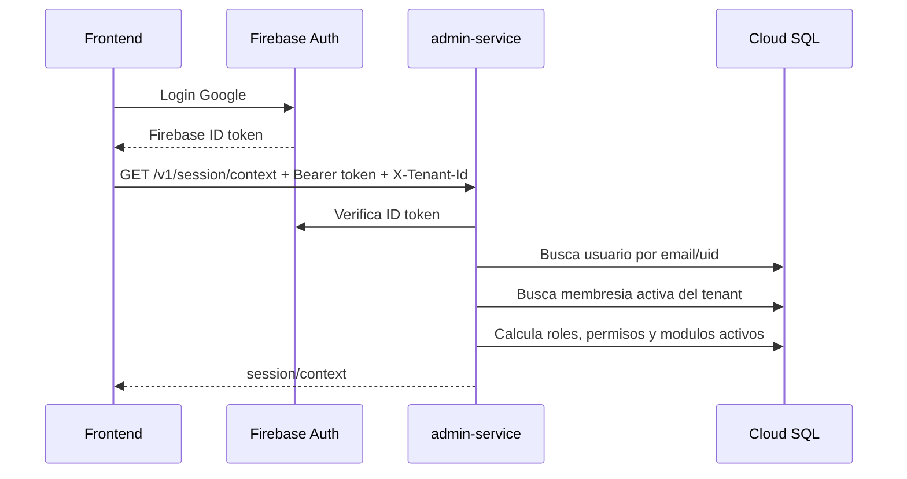
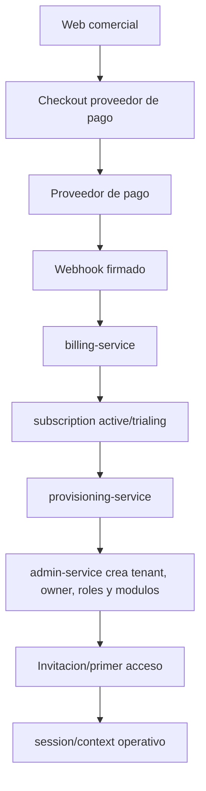

# ERClave - Modelo multitenant, identidad y contratacion

## 1. Objetivo

Este documento aterriza el modelo multitenant de ERClave despues de incorporar Firebase Auth en QA.

La regla central es:

> Firebase Auth identifica a la persona. ERClave decide a que tenant pertenece, que rol tiene, que permisos aplica, que modulos contrato y que limites comerciales gobiernan su acceso.

Por lo tanto, Firebase no debe convertirse en la fuente de verdad de roles, permisos, planes, alcances operativos ni estado comercial del cliente.

La politica normativa de aislamiento para tablas, APIs, repositorios, frontend y pruebas anti-fuga vive en
`docs/arquitectura/politica_aislamiento_tenant.md`. Este documento describe el modelo; la politica define los
guardrails obligatorios para implementar funcionalidades ERP cliente.

---

## 2. Responsabilidades por capa

| Capa | Responsabilidad | No debe hacer |
|---|---|---|
| Firebase Auth | Autenticacion, proveedor Google, emision de ID token, recuperacion/sesion de usuario. | Definir permisos ERClave, modulos contratados, limites de plan o estado del tenant. |
| Frontend | Iniciar sesion, enviar `Authorization: Bearer <idToken>`, mostrar UI segun `session/context`. | Confiar en localStorage para permisos reales o proteger reglas de negocio solo en UI. |
| `admin-service` | Resolver usuario, tenant, membresia, roles, permisos, entitlements, settings y policy. | Delegar autorizacion a Firebase claims sin validacion en BD. |
| Servicios operativos | Ejecutar reglas de su dominio filtrando por `tenant_id` y validando permisos/modulo. | Leer o escribir datos de otros tenants, o decidir permisos sin contexto. |
| `billing-service` | Planes, suscripciones, cobros, webhooks, estado comercial y cambios de plan. | Crear datos operativos directamente en schemas de otros servicios. |
| `provisioning-service` | Orquestar alta idempotente del tenant, owner inicial, modulos y configuracion base. | Activar tenant sin pago confirmado o aprobacion interna. |

---

## 3. Identidad global y membresia por tenant

ERClave debe manejar identidades globales y membresias por tenant:

```text
admin.users
  identidad global conocida por ERClave
  email, display_name, status, identity_provider_id opcional

admin.memberships
  relacion usuario-tenant
  tenant_id, user_id, status, fechas de invitacion/activacion/desactivacion

admin.membership_roles
  roles asignados a esa membresia en ese tenant
```

Esto permite que una misma persona:

- sea owner en una empresa;
- sea supervisor en otra;
- este desactivada en un tenant;
- conserve su identidad global sin duplicar cuentas;
- cambie de rol por tenant sin afectar otros tenants.

Regla:

```text
email/firebase_uid -> admin.users -> admin.memberships por tenant -> roles -> permisos efectivos
```

---

## 4. Resolucion de contexto de sesion

Flujo recomendado para cada sesion web:



El `session/context` debe incluir como minimo:

| Dato | Uso |
|---|---|
| `tenant` | Empresa activa, estado, timezone, locale y plan. |
| `user` | Identidad visible y estatus dentro del tenant. |
| `roles` | Roles asignados a la membresia dentro del tenant. |
| `permissions` | Permisos efectivos calculados desde roles activos. |
| `entitlements` | Derecho contractual (`status`), preferencia del cliente (`tenant_enabled`) y disponibilidad calculada (`effective_active`). |
| `active_modules` | Codigos con entitlement activo y preferencia del tenant encendida, disponibles para navegacion y autorizacion. |
| `entitlement_limits` | Limites comerciales por modulo: usuarios, almacenes, API calls, etc. |
| `scope` | Alcance operativo resuelto para la sesion, iniciando por sucursales disponibles. |

---

## 5. Seleccion de tenant

Para MVP QA se puede usar `X-Tenant-Id` porque solo hay tenant demo controlado.

Para producto real hay tres opciones compatibles:

| Opcion | Ejemplo | Uso recomendado |
|---|---|---|
| Subdominio por tenant | `cliente.eslaclave.com` | Mejor experiencia para clientes con tenant unico. |
| Selector post-login | Usuario entra y elige empresa | Necesario cuando una persona tiene multiples tenants. |
| URL con slug interno | `/t/demo-qa/...` | Util para QA, soporte y administracion interna. |

Regla de seguridad:

> El tenant solicitado debe validarse contra las membresias del usuario autenticado. Nunca basta con recibir un `tenant_id` desde frontend.

Si un usuario tiene multiples tenants, el backend debe devolver una lista de membresias elegibles y exigir seleccion explicita antes de cargar contexto operativo.

---

## 6. Autorizacion y policy

ERClave debe evaluar acceso con cuatro capas:

```text
1. Tenant activo
2. Membresia activa
3. Modulo contratado y activo
4. Permiso efectivo concedido por rol
```

Ejemplo:

```text
usuario autenticado = chema@cliente.com
tenant = ten_acme
modulo = inventory
accion = inventory.movement.create

permitir si:
  tenant.status = active
  membership.status = active
  tenant_modules.inventory.status = active
  role_permissions incluye inventory.movement.create
```

La UI puede ocultar botones, pero el backend debe rechazar acciones no permitidas.

---

## 7. Roles y alcances

Los roles son por tenant, no globales.

Roles iniciales sugeridos:

| Rol | Alcance |
|---|---|
| `owner` | Control del tenant, usuarios, roles, configuracion y encendido de modulos ya concedidos; no cambia el contrato. |
| `admin` | Administracion operativa sin poder cancelar contrato ni cambiar owner principal. |
| `supervisor` | Operacion y aprobaciones de uno o varios modulos. |
| `operator` | Captura y consulta limitada. |
| `viewer` | Lectura sin cambios. |
| `billing_admin` | Pagos, facturacion, plan y suscripcion. |
| `developer_admin` | API clients, integraciones, scopes y cuotas. |

Los alcances finos deben expresarse como permisos:

```text
admin.user.invite
admin.role.update
production.product_service.read
inventory.movement.create
sales.quote.approve
billing.subscription.manage
integrations.api_client.rotate_secret
```

Para permisos avanzados se pueden agregar scopes por dimension:

| Dimension | Ejemplo |
|---|---|
| Unidad de negocio | Solo sucursal norte. |
| Almacen | Solo `wh_central`. |
| Importe | Aprobar cotizaciones hasta cierto monto. |
| Recurso | Solo productos/servicios de cierta categoria. |
| Integracion | Solo ciertos scopes/API clients. |

---

## 8. Entitlements, planes y limites

Un tenant no tiene acceso a un modulo solo porque el usuario tenga permiso.

Debe cumplirse:

```text
permiso concedido + modulo contratado + tenant activo + limite disponible
```

Entidades conceptuales:

| Entidad | Dueno | Uso |
|---|---|---|
| `billing.plans` | `billing-service` | Planes comerciales base. |
| `billing.plan_modules` | `billing-service` | Modulos incluidos por plan. |
| `billing.subscriptions` | `billing-service` | Estado comercial del cliente. |
| `admin.tenant_modules` | `admin-service` | Modulos efectivos habilitados para el tenant. |
| `admin.tenant_settings` | `admin-service` | Parametros funcionales del tenant. |
| `integrations.api_usage` | `integration-service` | Consumo medido para cuotas/API. |

### 8.1 Perfil organizacional del tenant

Todo tenant debe tener un setting inicial:

```text
admin.tenant_settings
  tenant_id = <tenant>
  module_code = admin
  key = organization.profile
```

`organization.profile` es la fuente de verdad inicial para:

- `corporate`: nombre corporativo, razon social principal, RFC, telefono y contacto administrativo.
- `legal_entities`: razones sociales/fiscales del corporativo, con RFC, regimen, uso CFDI, direccion fiscal y contacto.
- `branches`: sucursales, matriz, centros de trabajo, almacenes o puntos de venta, opcionalmente ligados a una razon social.

Reglas:

1. Firebase Auth no guarda esta estructura.
2. El frontend no debe ser fuente de verdad; consume por `GET /v1/settings` y actualiza corporativo con `PUT /v1/settings/organization.profile`.
3. Razones sociales y sucursales se administran por endpoints finos de `admin-service`: `POST/PATCH /v1/organization/legal-entities`, `POST /v1/organization/legal-entities/{id}/activate|deactivate`, `POST/PATCH /v1/organization/branches` y `POST /v1/organization/branches/{id}/activate|deactivate`.
4. Provisioning, seeds y APIs internas que creen tenants deben inicializar `organization.profile`.
5. Si facturacion, contabilidad o fiscal requieren integridad transaccional mayor, estas listas pueden promoverse a tablas dedicadas, dejando `organization.profile` como perfil administrativo de arranque o snapshot.

Estados sugeridos de modulo:

| Estado | Significado |
|---|---|
| `active` | Modulo disponible. |
| `inactive` | Modulo no contratado o apagado. |
| `suspended` | Modulo temporalmente bloqueado por pago, soporte o decision interna. |
| `trial` | Modulo habilitado por periodo de prueba. |

---

## 9. Contratacion en linea y provisioning

La contratacion en linea debe crear tenants solo despues de una confirmacion confiable.



Reglas:

1. La pagina de exito del checkout no activa el tenant.
2. El webhook firmado del proveedor es la fuente de verdad de pago.
3. Provisioning debe ser idempotente.
4. Si falla a mitad, debe reintentar sin duplicar tenant, usuario ni suscripcion.
5. El owner inicial debe quedar como membresia activa o invitada segun el flujo elegido.
6. Los modulos efectivos deben derivarse del plan contratado y ajustes comerciales autorizados.
7. Toda activacion manual debe auditar responsable, motivo, vigencia y alcance.

---

## 10. Estados de tenant y acceso

| Estado tenant | Lectura | Escritura | Billing | Admin owner | Uso esperado |
|---|---|---|---|---|---|
| `provisioning` | No | No | Si | No | Alta en proceso. |
| `active` | Si | Si | Si | Si | Operacion normal. |
| `past_due` | Si | Limitada por politica | Si | Si | Pago vencido con periodo de gracia. |
| `suspended` | Limitada | No | Si | Si | Bloqueo por pago/fraude/soporte. |
| `cancelled` | Exportacion/consulta limitada | No | Si | Limitado | Cliente cancelado. |
| `disabled` | No | No | Interno | Interno | Bloqueo administrativo severo. |

Politica recomendada:

- No borrar datos por falta de pago.
- Permitir que owner/billing admin pueda pagar o reactivar.
- Bloquear integraciones y escrituras antes que bloquear toda lectura.
- Mantener auditoria de cambios de estado.

---

## 11. Implicaciones para APIs

Cada endpoint operativo debe declarar y validar:

| Elemento | Ejemplo |
|---|---|
| Tenant requerido | `X-Tenant-Id`, subdominio o contexto resuelto. |
| Modulo requerido | `x-required-module: production`. |
| Permiso requerido | `x-permissions: [production.product_service.create]`. |
| Idempotencia | `Idempotency-Key` en mutaciones. |
| Auditoria | actor, tenant, accion, recurso, correlation_id. |

Orden recomendado en middleware o dependencia:

```text
verify token
resolve tenant
load membership
validate tenant status
validate module entitlement
validate permission
execute domain action
write audit/outbox when needed
```

---

## 12. Implicaciones para datos

Reglas obligatorias:

- Toda tabla operativa de cliente debe tener `tenant_id`.
- Indices principales deben incluir `tenant_id`.
- Las queries deben filtrar por `tenant_id` desde repositorio/backend.
- No debe haber foreign keys entre schemas de servicios distintos.
- Las referencias cruzadas usan IDs estables y validacion por contrato.
- Los datos globales se pueden compartir solo si son catalogos EsLaClave.
- Las personalizaciones de un catalogo global viven con `tenant_id`.

Ejemplo:

```text
production.product_services
  tenant_id + id
  tenant_id + code
  tenant_id + status
```

---

## 13. Implicaciones para frontend

El frontend debe tratar `session/context` como su fuente de verdad para:

- menu de modulos;
- botones visibles;
- nombre del usuario;
- tenant activo;
- mensajes de suspension o falta de pago;
- limites visibles;
- sucursal activa y sucursales disponibles para la sesion;
- selector de tenant si aplica.

No debe:

- guardar permisos permanentes en localStorage;
- asumir que Firebase email implica acceso;
- permitir cambiar `tenant_id` sin recargar contexto;
- confiar en botones ocultos como seguridad.

---

## 14. Implicaciones para soporte y administracion interna

El equipo interno de EsLaClave necesitara capacidades separadas del panel del cliente:

| Capacidad | Motivo |
|---|---|
| Buscar tenants | Soporte y operacion comercial. |
| Ver estado de suscripcion | Resolver pagos, renovaciones y suspensiones. |
| Activar/suspender manualmente | Contratos offline, demos, soporte, fraude. |
| Reenviar invitacion owner | Onboarding. |
| Ver auditoria | Soporte y cumplimiento. |
| Impersonation controlada o soporte asistido | Diagnostico, solo con auditoria estricta. |

La consola interna no debe compartir permisos con el tenant del cliente. Debe tener roles internos propios.

---

## 15. Decisiones actuales

| Decision | Estado |
|---|---|
| Firebase Auth como proveedor de identidad QA | Adoptado. |
| Roles/permisos en ERClave, no Firebase | Adoptado. |
| Usuarios globales + membresias por tenant | Adoptado en modelo fisico inicial. |
| `tenant_id` logico en base compartida para MVP | Adoptado. |
| `session/context` como contrato de contexto | Adoptado con roles, permisos, limites y alcance de sucursales. |
| Billing/provisioning separado del core operativo | Recomendado, pendiente de implementacion. |
| Alta inicial tenant + owner | Adoptado mediante `POST /v1/provisioning/tenant-onboarding`; pendiente autenticacion service-to-service fuerte. |
| Backoffice interno EsLaClave | Adoptado como frontend separado para alta de tenants, soporte y futura integracion con billing. |
| Selector multi-tenant para usuarios con varias empresas | Pendiente. |
| Subdominio por tenant | Futuro, no requerido para QA. |
| Suspensiones por pago con acceso limitado | Recomendado, pendiente de policy final. |

---

## 16. Siguientes pasos recomendados

1. Agregar autenticacion service-to-service fuerte para `POST /v1/provisioning/tenant-onboarding`.
2. Agregar validacion de permiso/modulo en `production-service`.
3. Documentar selector de tenant para usuarios multiempresa.
4. Disenar endpoints MVP de `billing-service` y `provisioning-service`.
5. Agregar estados comerciales `past_due`, `suspended` y reglas de acceso.
6. Crear pruebas de aislamiento: usuario de tenant A no puede leer tenant B.
