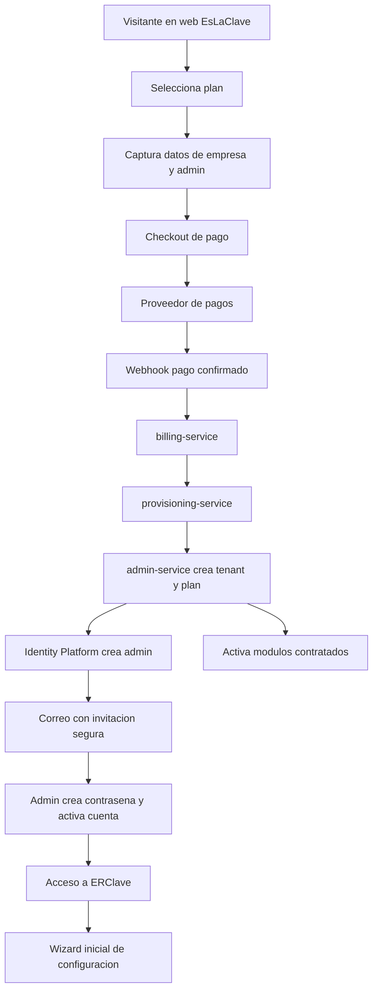
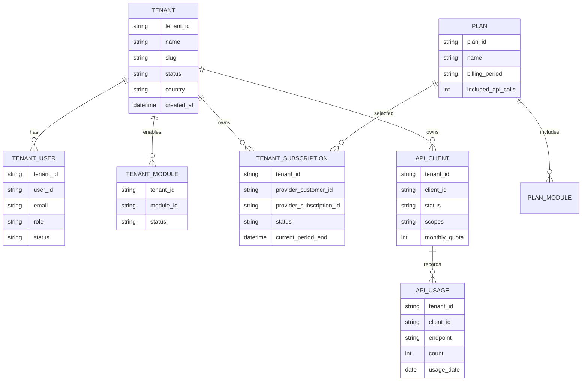
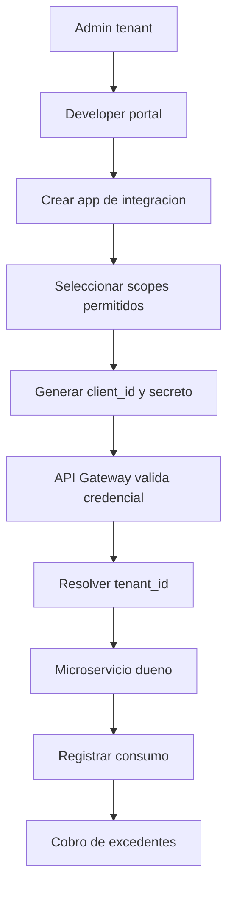
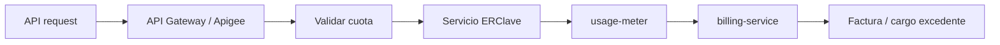

# ERClave - Onboarding comercial SaaS

Este documento describe el flujo objetivo para que un cliente pueda contratar ERClave desde la web de EsLaClave, pagar en linea, recibir acceso seguro, activar su tenant y, si su plan lo permite, integrar sistemas externos mediante APIs controladas.

El objetivo es separar claramente:

- compra y suscripcion;
- aprovisionamiento de tenant;
- administracion inicial del cliente;
- activacion de modulos;
- acceso al sistema;
- APIs comerciales e integraciones;
- medicion de consumo y cobro por uso.

Diagrama editable:

- `docs/arquitectura/diagramas/onboarding_comercial_saas.drawio`
- `docs/arquitectura/diagramas/flujo_negocio_adquisicion_uso.drawio`

---

## 1. Principios

- No enviar contrasenas por correo.
- El pago confirmado por webhook debe ser la fuente de verdad para provisionar.
- El tenant debe crearse de forma idempotente.
- Cada tenant debe tener plan, modulos, limites, usuarios y configuracion propios.
- El usuario administrador inicial debe activar su cuenta con un enlace temporal.
- La URL puede ser compartida, pero cada request debe resolver `tenant_id`, usuario, permisos y plan.
- Las integraciones externas deben tener credenciales, scopes, cuotas y auditoria.
- Las APIs publicas deben poder medirse para cobrar uso adicional.
- La plataforma debe iniciar con bajo costo y escalar por demanda.

---

## 2. Flujo de compra y activacion



Regla principal:

- El acceso no debe activarse solo porque el usuario llego a la pagina de exito del checkout.
- El acceso debe activarse cuando el backend recibe y valida el evento de pago exitoso.

---

## 3. Estados del flujo comercial

### Estado del prospecto/checkout

| Estado | Descripcion |
|---|---|
| `lead` | El cliente capturo datos pero aun no inicio pago. |
| `checkout_started` | Se creo sesion de checkout. |
| `payment_pending` | El pago esta pendiente o requiere accion. |
| `payment_failed` | El pago fallo o expiro. |
| `payment_confirmed` | El proveedor confirmo pago exitoso. |
| `provisioning` | ERClave esta creando tenant, usuario y plan. |
| `active` | Tenant listo para operar. |

### Estado del tenant

| Estado | Descripcion |
|---|---|
| `provisioning` | Tenant en creacion. |
| `active` | Tenant operativo. |
| `past_due` | Pago vencido o problema de cobro. |
| `suspended` | Acceso restringido por falta de pago, fraude o decision administrativa. |
| `cancelled` | Servicio cancelado. |

### Estado de suscripcion

El estado de suscripcion debe venir del proveedor de pagos y reflejarse en ERClave.

| Estado | Uso en ERClave |
|---|---|
| `trialing` | Permite acceso durante periodo de prueba. |
| `active` | Permite acceso normal. |
| `past_due` | Puede mostrar avisos y restringir funciones segun politica. |
| `unpaid` | Puede suspender acceso o integraciones. |
| `canceled` | Revoca acceso a nuevas operaciones segun contrato. |
| `incomplete` | No provisionar hasta confirmacion de pago. |

---

## 4. Servicios involucrados

| Servicio | Responsabilidad |
|---|---|
| `marketing-site` | Presentar planes, precios y CTA de compra. |
| `billing-service` | Crear checkout, recibir webhooks, mapear planes y estado de suscripcion. |
| `provisioning-service` | Orquestar creacion idempotente de tenant y recursos iniciales. |
| `admin-service` | Crear tenant, admin inicial, roles, permisos, modulos activos y configuracion base. |
| `identity-service` / Identity Platform | Gestionar identidad, invitaciones y autenticacion. |
| `notification-service` | Enviar correos de activacion, pago, suspension y avisos. |
| `developer-portal` | Gestionar apps, credenciales, documentacion y consumo de API. |
| `api-gateway` / Apigee | Proteger APIs, aplicar scopes, cuotas, analytics y monetizacion futura. |

Nota:

- `billing-service` y `provisioning-service` pueden iniciar como un solo servicio pequeno si el MVP necesita reducir complejidad.
- Si el flujo crece, se separan para aislar cobros de aprovisionamiento.

---

## 5. Datos minimos de contratacion

| Dato | Uso |
|---|---|
| Nombre de empresa | Nombre visible del tenant. |
| Razon social / RFC | Facturacion cuando aplique. |
| Pais / region | Impuestos, moneda, formatos y legal. |
| Nombre del administrador | Usuario inicial. |
| Email del administrador | Identidad e invitacion. |
| Telefono opcional | Contacto comercial o soporte. |
| Plan seleccionado | Modulos, limites y precio. |
| Metadata de pago | Relacion con customer/subscription del proveedor. |

No guardar datos sensibles de tarjeta en ERClave. Esa responsabilidad debe quedar en el proveedor de pagos.

---

## 6. Modelo minimo de tenant



---

## 7. Activacion segura del administrador

No se debe mandar usuario y contrasena por correo.

Flujo recomendado:

1. Crear usuario administrador en estado `invited`.
2. Generar enlace temporal de activacion.
3. Enviar correo con enlace.
4. Usuario abre enlace.
5. Usuario crea contrasena y acepta terminos.
6. Usuario entra a ERClave.
7. Sistema fuerza wizard inicial.

El enlace debe:

- expirar;
- ser de un solo uso;
- estar ligado al tenant y correo;
- registrar fecha de uso;
- invalidarse si se reenvia invitacion.

---

## 8. Wizard inicial del tenant

Primer acceso del administrador:

1. Confirmar datos de empresa.
2. Configurar moneda, zona horaria e idioma.
3. Revisar modulos incluidos en el plan.
4. Crear usuarios iniciales.
5. Definir roles y permisos basicos.
6. Cargar catalogos base o usar ejemplos.
7. Entrar a Produccion, Almacenes o Ventas segun plan.

---

## 9. Planes, modulos y entitlements

El plan no debe ser solo un nombre comercial. Debe convertirse en derechos concretos del tenant.

Ejemplo:

| Plan | Modulos | Limites |
|---|---|---|
| Basico | Produccion, Almacenes | Usuarios limitados, sin API publica. |
| Operativo | Produccion, Almacenes, Ventas | Mas usuarios, API basica incluida. |
| Integracion | Produccion, Almacenes, Ventas, API | Llamadas API incluidas y developer portal. |
| Enterprise | Modulos y limites personalizados | Soporte, cuotas y aislamiento avanzado. |

Entitlements sugeridos:

- `module.production.enabled`
- `module.inventory.enabled`
- `module.sales.enabled`
- `api.access.enabled`
- `api.monthly_calls.included`
- `users.max_count`
- `storage.max_gb`
- `support.level`

---

## 10. API comercial e integraciones

Si el cliente contrata integraciones, ERClave debe crear una app de integracion.

Flujo:



Cada app debe tener:

- `client_id`;
- secreto o mecanismo equivalente;
- tenant asociado;
- scopes;
- cuotas;
- rate limit;
- estado;
- fecha de creacion;
- ultimo uso;
- rotacion de secreto;
- bitacora de consumo.

Scopes sugeridos:

- `production:read`
- `production:write`
- `inventory:read`
- `inventory:write`
- `sales:read`
- `sales:write`
- `reports:read`

Reglas:

- Las credenciales API nunca deben tener acceso global.
- Cada request API debe resolver `tenant_id` desde la credencial o token.
- El cliente no debe poder enviar un `tenant_id` arbitrario para acceder a otro tenant.
- Los limites se aplican por tenant, app, plan y periodo.
- Las APIs deben tener documentacion publica por version.

---

## 11. Medicion y cobro por API

Para controlar costo y monetizacion:



Metricas minimas:

- llamadas por tenant;
- llamadas por app;
- llamadas por endpoint;
- errores 4xx/5xx;
- latencia;
- cuota usada;
- excedente facturable;
- ultimo uso por credencial.

---

## 12. Tecnologia recomendada por fase

### MVP real de bajo costo

| Necesidad | Recomendacion |
|---|---|
| Pagos | Stripe Checkout + Stripe Billing o proveedor equivalente disponible para mercado objetivo. |
| Webhooks | Cloud Run endpoint dedicado en `billing-service`. |
| Identidad | Google Cloud Identity Platform o proveedor OIDC compatible. |
| Tenant | `admin-service` con `tenant_id` y modulos activos. |
| Email | SendGrid, Mailgun, Resend o proveedor transaccional similar. |
| API interna | API Gateway ligero + FastAPI. |
| Metering inicial | Tabla `api_usage` + jobs de agregacion. |

### Escala / monetizacion avanzada

| Necesidad | Recomendacion |
|---|---|
| API products, developer apps y monetizacion | Apigee. |
| Analitica de uso | BigQuery. |
| Facturacion de excedentes | Billing service conectado al proveedor de pagos. |
| Tenants enterprise | Base dedicada, schema dedicado o proyecto dedicado segun contrato. |

---

## 13. Seguridad minima

- No enviar contrasenas por correo.
- Usar HTTPS en todos los endpoints.
- Validar firma de webhooks.
- Registrar idempotency key de eventos de pago.
- Guardar secretos en Secret Manager.
- Rotar client secrets.
- No exponer datos sensibles en logs.
- Auditar cambios de plan, usuario, permiso, credencial API y tenant.
- Bloquear provisioning duplicado para el mismo pago.
- Separar llaves de QA y Produccion.

---

## 14. Eventos sugeridos

- `billing.checkout.started`
- `billing.subscription.active`
- `billing.subscription.past_due`
- `billing.subscription.cancelled`
- `tenant.provisioning.started`
- `tenant.provisioning.completed`
- `tenant.provisioning.failed`
- `tenant.admin.invited`
- `tenant.admin.activated`
- `api.client.created`
- `api.usage.limit_exceeded`

Cada evento debe incluir:

- `event_id`;
- `event_type`;
- `event_version`;
- `tenant_id` si ya existe;
- `external_reference` si viene de pago;
- `idempotency_key`;
- `occurred_at`;
- `source_service`;
- `payload`.

---

## 15. Dominio, DNS y entrada publica

### Decision inicial recomendada

Para el lanzamiento publico controlado de ERClave se recomienda:

- comprar el dominio en un registrador externo de bajo costo y buena operacion, preferentemente Cloudflare Registrar;
- mantener DNS inicial en Cloudflare para simplificar certificados, CDN, proteccion basica y administracion de registros;
- desplegar backend, datos, secretos, eventos y observabilidad en Google Cloud;
- evitar depender de Google Domains/Cloud Domains como registrador principal, ya que Google Domains fue migrado a Squarespace y Cloud Domains ya no debe tratarse como ruta principal para nuevos registros;
- evaluar Google Cloud DNS solo si se requiere gobierno de DNS dentro de GCP, infraestructura como codigo centralizada o controles corporativos mas estrictos.

Esta decision separa dos responsabilidades:

| Capa | Recomendacion | Motivo |
|---|---|---|
| Registro de dominio | Cloudflare Registrar o registrador equivalente | Bajo costo anual, renovaciones simples y administracion directa. |
| DNS publico | Cloudflare DNS | Operacion simple, buen panel, CDN/SSL y bajo costo inicial. |
| Aplicacion SaaS | Google Cloud | Mantener la plataforma en Cloud Run, Cloud SQL, Pub/Sub, Storage, Secret Manager y observabilidad. |
| DNS enterprise futuro | Google Cloud DNS opcional | Util cuando se quiera administrar DNS como parte formal de la infraestructura GCP. |

### Dominios sugeridos

Prioridad de compra:

1. `eslaclave.com` como dominio comercial principal.
2. `eslaclave.mx` o `eslaclave.com.mx` para proteger presencia en Mexico.
3. `erclave.com` como posible dominio corto para app, API o producto tecnico si esta disponible.

### Subdominios base

| Subdominio | Uso |
|---|---|
| `www.eslaclave.com` | Sitio comercial y captura de prospectos. |
| `app.eslaclave.com` | Aplicacion SaaS para clientes. |
| `api.eslaclave.com` | APIs publicas y privadas de ERClave. |
| `docs.eslaclave.com` | Documentacion para usuarios, administradores e integradores. |
| `status.eslaclave.com` | Estado del servicio cuando exista operacion productiva. |
| `qa.eslaclave.com` | Ambiente QA interno o controlado, no para clientes finales. |

### Acceso por tenant

Para el MVP se recomienda usar una ruta por tenant en la aplicacion:

```text
https://app.eslaclave.com/t/{tenant_slug}
```

Esto evita crear subdominios dinamicos por cada cliente desde el dia uno y simplifica DNS, certificados y soporte.

Cuando existan clientes enterprise o necesidades de marca blanca, se puede habilitar:

```text
https://{tenant_slug}.eslaclave.com
https://erp.cliente.com
```

En ambos casos el backend debe resolver el `tenant_id` desde identidad, token, contrato y configuracion, nunca solo desde el texto del dominio.

### Cobro hibrido y activacion manual

El dominio publico debe soportar dos entradas comerciales:

| Entrada | Flujo |
|---|---|
| Compra en linea | Landing -> checkout -> webhook verificado -> activacion de suscripcion -> provision de tenant -> invitacion al administrador. |
| Contacto comercial | Landing -> formulario/contacto -> validacion interna -> activacion manual en panel admin -> provision de tenant -> invitacion al administrador. |

Ambas rutas deben terminar en el mismo contrato interno:

- `subscription.activated`;
- `tenant.provision.requested`;
- `tenant.provisioning.completed`;
- `tenant.admin.invited`.

La activacion manual reduce dependencia del pago en linea al inicio, pero no debe saltarse auditoria, plan contratado, modulos activos, limites, vigencia ni responsable comercial.

### Costo operativo esperado para lanzamiento controlado

Para un lanzamiento publico limitado, por ejemplo hasta 20 tenants, el costo principal sera infraestructura y operacion minima, ya que el desarrollo lo ejecutara internamente el equipo.

Rango recomendado de presupuesto mensual:

| Escenario | Rango mensual estimado | Comentario |
|---|---:|---|
| Trafico bajo y uso controlado | USD 80 a 200 | Posible si Cloud Run, auth y almacenamiento se mantienen ligeros. |
| Presupuesto sano de salida | USD 150 a 500 | Recomendado para no operar al limite y cubrir logs, backups y margen. |
| Mayor uso o clientes mas activos | USD 500+ | Dependera de base de datos, logs, almacenamiento, correos, trafico y soporte. |

Costos separados:

- dominio: pago anual aproximado segun extension y registrador;
- comisiones de pago en linea: porcentaje por transaccion del proveedor de pagos;
- correo transaccional: puede iniciar en plan bajo o gratuito segun proveedor;
- monitoreo, logs y backups: deben tener presupuesto aunque el trafico sea pequeno;
- soporte y operacion: aunque no sea factura cloud, consume tiempo real del equipo.

### Criterios de arquitectura

- No enviar contrasenas por correo al crear el tenant.
- No crear tenants solo por una llamada de frontend; debe existir evento verificado de pago o activacion manual auditada.
- No usar el dominio como unico mecanismo de aislamiento.
- No mezclar QA y Produccion bajo los mismos recursos criticos.
- No exponer APIs de integracion sin `client_id`, scopes, cuotas, auditoria y relacion explicita con `tenant_id`.

---

## 16. Decisiones pendientes

- Proveedor de pagos final.
- Si se usara Identity Platform multi-tenant desde el inicio o aislamiento logico en app con OIDC.
- Dominio final comprado y variantes para proteger marca.
- Politica de suspension por falta de pago.
- Planes comerciales y limites.
- Moneda e impuestos por pais.
- Proveedor de email transaccional.
- Nivel inicial de API Gateway vs Apigee.
- Estrategia de portal de desarrolladores.
