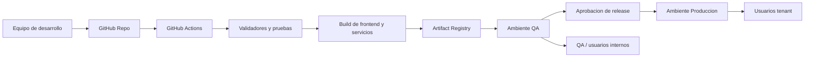
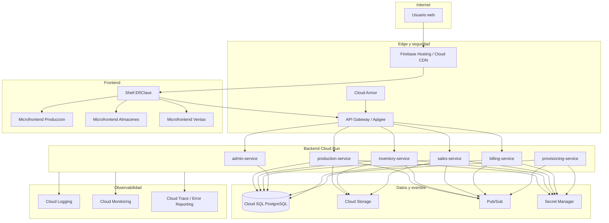
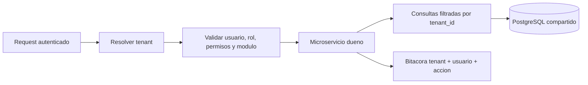
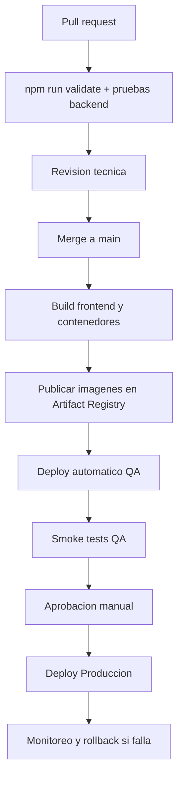

# ERClave - Arquitectura QA y Produccion

Este documento define la arquitectura inicial para llevar ERClave desde la maqueta funcional hacia ambientes reales de QA y Produccion.

El objetivo no es sobredimensionar la plataforma desde el dia uno, sino establecer una base escalable, segura y operable para los primeros modulos reales: Produccion, Almacenes y Ventas.

Diagrama editable:

- `docs/arquitectura/diagramas/arquitectura_qa_prod.drawio`

Documento relacionado:

- `docs/arquitectura/fronteras_ambientes_local_qa_produccion.md` como fuente normativa de fronteras, preflight y promocion.

La definicion vigente establece Local completamente aislado con Firebase Emulator. Cualquier consumo de QA desde un proceso local se denomina `local conectado a QA` y requiere autorizacion explicita. QA permanece en `erclave.web.app`; Produccion usara otro dominio y un proyecto GCP separado.

- `docs/arquitectura/onboarding_comercial_saas.md`

---

## 1. Principios

- QA y Produccion deben estar separados.
- Los despliegues deben ser reproducibles, no manuales.
- Todo cambio debe pasar por validadores, pruebas y trazabilidad.
- El frontend debe publicarse como shell/microfrontends, no como logica de negocio critica.
- El backend debe concentrar reglas criticas en microservicios.
- Cada peticion debe identificar tenant, usuario, permisos y modulo.
- Los datos de un tenant no deben mezclarse con los de otro.
- Los contratos API y eventos deben versionarse.
- Los servicios deben ser observables: logs, metricas, trazas y errores.
- La arquitectura debe permitir crecer sin obligar a reescribir todo el MVP.

---

## 2. Vista general

---

## 3. Ambientes

| Ambiente | Uso | Datos | Acceso | Despliegue |
|---|---|---|---|---|
| Local | Desarrollo diario | Mock, fixtures o datos anonimizados | Desarrolladores | Manual local |
| QA | Validacion funcional y tecnica | Datos de prueba controlados | Equipo interno y usuarios piloto | Pipeline automatico desde rama o tag |
| Produccion | Operacion real de clientes | Datos reales por tenant | Usuarios finales | Pipeline con aprobacion |

Reglas:

- QA no debe usar la base de datos de Produccion.
- Produccion no debe depender de recursos de QA.
- Los secretos deben estar separados por ambiente.
- Los logs de QA y Produccion deben poder consultarse por separado.
- El dominio de QA debe distinguirse claramente del dominio productivo.

---

## 4. Arquitectura objetivo por ambiente

---

## 5. Stack recomendado inicial

| Capa | Tecnologia recomendada | Motivo |
|---|---|---|
| Frontend hosting | Firebase Hosting o Cloud Run + CDN | Bajo mantenimiento, despliegue simple y CDN administrado. |
| Frontend app | Shell + microfrontends progresivos | Separacion modular sin reescribir toda la maqueta de golpe. |
| Backend API | FastAPI en Cloud Run | API moderna, OpenAPI nativo, escalamiento automatico. |
| Base de datos | Cloud SQL PostgreSQL | Relacional, conocida, suficiente para MVP multi-tenant. |
| Migraciones | Alembic | Versionamiento de esquema. |
| ORM | SQLAlchemy o SQLModel | Modelado claro y compatible con FastAPI. |
| Eventos | Pub/Sub | Integracion asincrona entre modulos. |
| Archivos | Cloud Storage | PDFs, XML, adjuntos y documentos generados. |
| Secretos | Secret Manager | Separacion segura por ambiente. |
| CI/CD | GitHub Actions + Artifact Registry + Cloud Deploy | Automatizacion y promocion controlada. |
| Observabilidad | Cloud Logging, Monitoring, Trace y Error Reporting | Operacion real y diagnostico. |
| Pagos y suscripciones | Proveedor externo tipo Stripe Billing/Checkout o equivalente | Reducir carga PCI y activar planes por webhook. |
| Identidad | Identity Platform u OIDC compatible | Usuarios por tenant, invitaciones y autenticacion administrada. |

---

## 6. Estrategia multi-tenant inicial

Para el MVP real se recomienda iniciar con aislamiento logico por `tenant_id` en la base de datos.

Detalle normativo del modelo multitenant, identidad, membresias, roles, permisos, entitlements y contratacion en linea:

- `docs/arquitectura/modelo_multitenant.md`

Reglas minimas:

- Toda tabla transaccional debe tener `tenant_id`.
- Toda consulta debe filtrar por `tenant_id`.
- Toda accion critica debe registrar usuario, tenant, fecha, accion y documento origen.
- Los tenants no deben compartir secuencias visibles si esto expone informacion sensible.
- Los permisos deben evaluarse por tenant y modulo.
- La configuracion de modulos activos debe venir de `admin-service`.

Escalamiento futuro:

- Si el volumen crece, separar tenants grandes en base dedicada o schema dedicado.
- Si se requiere escala global, evaluar Cloud Spanner con interfaz PostgreSQL.
- Si reportes empiezan a pesar, mover analitica a BigQuery/read models.

---

## 7. CI/CD propuesto

Reglas:

- Ningun despliegue a Produccion sin validadores.
- QA puede desplegarse automaticamente desde `main` o rama de release.
- Produccion requiere aprobacion manual.
- Cada release debe tener commit, fecha, responsable y notas.
- El rollback debe ser posible por version de imagen o artifact.

### 7.1 Pipeline QA implementado

- `.github/workflows/qa-candidate.yml` es manual, exige SHA completo y construye cuatro imagenes por digest mediante identidad federada.
- `.github/workflows/qa-release.yml` consume esos digests y separa las aprobaciones `qa-database`, `qa-services`, `qa-traffic` y `qa-frontend`.
- Las revisiones se crean con tag `candidate` y sin trafico; el smoke comprueba ambiente, base, SHA y URL publica antes de permitir promocion.
- El frontend QA se construye sin URLs locales, Firebase Emulator, tenant ni actor local; el mismo directorio guardado como artefacto se entrega a Firebase Hosting.
- GitHub Pages permanece como maqueta de ejecucion manual y no publica automaticamente cambios de `main`.
- Las cuentas runtime y el migrador son dedicados; GitHub usa Workload Identity Federation y no llaves JSON.
- El pipeline permanece inoperante hasta aprovisionar las identidades, variables y protecciones documentadas en `infra/qa/README.md` mediante una autorizacion posterior.

---

## 8. Modulos MVP a migrar primero

| Modulo | Microfrontend | Microservicio | Prioridad |
|---|---|---|---|
| Produccion | `frontend/microfrontends/produccion` | `production-service` | Alta |
| Almacenes | `frontend/microfrontends/almacenes` | `inventory-service` | Alta |
| Ventas | `frontend/microfrontends/ventas` | `sales-service` | Alta |
| Administracion | `frontend/microfrontends/administracion` | `admin-service` | Soporte transversal |
| Billing/onboarding | Web EsLaClave / portal admin | `billing-service` + `provisioning-service` | Soporte comercial |

Orden recomendado:

1. Administracion minima: tenants, usuarios, roles, permisos y modulos activos.
2. Onboarding comercial: compra, pago, provisioning, invitacion y tenant activo.
3. Produccion: productos/servicios, recetas, ordenes y etapas.
4. Almacenes: recursos, existencias, reservas y movimientos.
5. Ventas: clientes, cotizaciones, pedidos y entregas.
6. Eventos entre Produccion, Almacenes y Ventas.

---

## 9. Contratos iniciales requeridos

### APIs

- `admin-service`: tenants, usuarios, roles, permisos, modulos activos.
- `billing-service`: checkout, suscripciones, webhooks, planes y estado de pago.
- `provisioning-service`: creacion idempotente de tenants y configuracion inicial.
- `production-service`: productos/servicios, recetas, validacion, ordenes, etapas.
- `inventory-service`: recursos, existencias, reservas, movimientos.
- `sales-service`: clientes, cotizaciones, pedidos, entregas.

### Eventos

- `production.order.created`
- `production.order.completed`
- `production.resource.shortage.detected`
- `inventory.reservation.created`
- `inventory.reservation.confirmed`
- `inventory.shortage.detected`
- `sales.order.approved`
- `sales.delivery.completed`
- `billing.subscription.active`
- `billing.subscription.past_due`
- `tenant.provisioning.completed`
- `tenant.admin.activated`

Cada evento debe tener:

- `event_id`;
- `event_type`;
- `event_version`;
- `tenant_id`;
- `occurred_at`;
- `source_service`;
- `document_origin`;
- `idempotency_key`;
- `payload`.

---

## 10. Criterios minimos para considerar QA real

- Existe ambiente separado de Produccion.
- Existe base de datos separada.
- Existe configuracion de secretos separada.
- El frontend se despliega desde pipeline.
- Al menos un servicio backend real responde healthcheck.
- Los validadores corren en CI.
- Existe documentacion de endpoints o contratos.
- Los errores se registran en logs consultables.
- Hay datos de prueba por tenant.

---

## 11. Criterios minimos para considerar Produccion real

- Autenticacion real.
- Tenant resuelto en cada request.
- Autorizacion por rol/modulo.
- Base de datos productiva con backups.
- Secretos en Secret Manager.
- Pipeline con aprobacion.
- Observabilidad activa.
- Auditoria de acciones criticas.
- Rollback documentado.
- Monitoreo basico de disponibilidad y errores.
- Separacion clara de QA y Produccion.

---

## 12. Riesgos a vigilar

| Riesgo | Mitigacion |
|---|---|
| Llevar reglas criticas solo en frontend | Mover reglas a microservicios y mantener frontend como orquestador visual. |
| Acoplar modulos por imports internos | Usar contratos, APIs y eventos. |
| Mezclar datos de tenants | `tenant_id`, permisos, filtros obligatorios y pruebas. |
| Sobredimensionar infraestructura | Serverless-first y crecimiento gradual. |
| No tener rollback | Versionar imagenes y artifacts. |
| No tener observabilidad | Logging, metrics y tracing desde QA. |
| QA parecido a local pero no a Prod | QA debe usar servicios cloud equivalentes, aunque con menor capacidad. |

---

## 13. Pendientes del arquitecto SaaS

- Definir si QA se despliega por rama, tag o entorno de GitHub.
- Definir naming convention de proyectos/servicios cloud.
- Definir estrategia inicial de base de datos multi-tenant.
- Definir formato OpenAPI base.
- Definir contrato de eventos base.
- Definir primer servicio real a implementar.
- Definir estrategia de migracion de `frontend/app.js` hacia shell + microfrontends.
- Definir estrategia de secrets y variables por ambiente.
- Definir plan de monitoreo y alertas.
